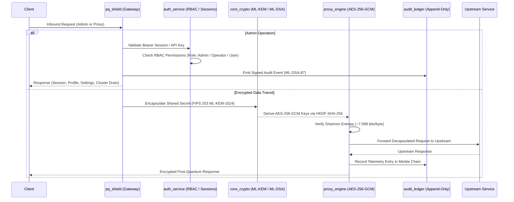

# Vardhan Post-Quantum Ingress Engine & Platform


The **Vardhan Post-Quantum Ingress Engine** is an enterprise-grade cryptographic interception gateway and high-availability distributed control plane. Built in memory-safe asynchronous Rust, the engine transparently upgrades network traffic (HTTP, TCP, gRPC) to NIST-standardized Post-Quantum Cryptography (**FIPS 203 ML-KEM** and **FIPS 204 ML-DSA**), maintains an immutable append-only BLAKE3 Merkle ledger, coordinates state via a from-scratch Raft consensus cluster, and provides an authenticated administrative dashboard.

Designed for seamless enterprise integration, the Vardhan engine enables immediate cryptographic modernization and strict adherence to **DORA (Article 9)** and **NIS2 (Article 21)** regulatory mandates—without requiring source code modifications to existing downstream microservices.

> **⚠️ Specification Phase Complete** — The Vardhan architecture has been fully specified through six specification documents, a threat model covering 98 threats across 16 trust domains, and a test contract covering 30+ executable tests. The full specification set is frozen and ready for implementation.

---

## 🏛️ Vardhan Specification Architecture

The Vardhan specification architecture defines the complete system through six authoritative documents, each building on the previous:

```
     ARCHITECTURE
         │
  Constitution v1.1
         ↓
   System Map v1.1
         │
         ▼
 DOMAIN CONTRACTS
         │
 Canonical Objects
         ↓
  State Machines
         ↓
 Object Traits
         │
         ▼
  SECURITY MODEL
         │
   Threat Model
         │
         ▼
  TEST CONTRACTS
         │
         ▼
  IMPLEMENTATION
```

| Document | Description | Size |
|---|---|---|
| `docs/VARDHAN_ARCHITECTURE_CONSTITUTION.md` | Constitutional foundation: 12 layers, 6 control-flow boundaries, state transition model, evidence model, event model, decision twin, 9 amendments (A1–A9) | ~1,500 lines |
| `docs/VARDHAN_SYSTEM_MAP.md` | 31-section system map: trust domains, decision twin lifecycle, policy pipeline, execution pipeline, tenant isolation, time model, event/state/evidence flow | ~1,440 lines |
| `docs/VARDHAN_CANONICAL_OBJECT_SPEC.md` | 27 canonical objects + TenantScoped&lt;T&gt; + TimeContext, 24 distinct newtypes, 15 dimensions per object | ~1,460 lines |
| `docs/VARDHAN_STATE_MACHINES.md` | 25 finite-state machines, 11 edge cases, 6 concurrency races, 3 specification corrections (A1–A3), Raft commit boundaries | ~1,395 lines |
| `docs/VARDHAN_OBJECT_TRAITS.md` | 34 distinct newtype identifiers, 29 traits, 3-layer marker traits (`SpeculativeState`/`CommittedState`/`AuthoritativeState`), `VardhanAuthorityGate` trait | ~790 lines |
| `docs/VARDHAN_THREAT_MODEL.md` | 98 threats across 18 categories, 16 trust domains, 18 security properties, 8 attack trees, 11 abuse cases, 30 test cases | ~1,423 lines |
| `docs/VARDHAN_TEST_CONTRACTS.md` | Complete pre-implementation test contract: 85+ test contracts covering authority chain, state correctness, tenant isolation, time, evidence, AI assurance, concurrency, Raft, execution, outcome, resource exhaustion, fault domains, idempotency, properties, and end-to-end scenarios | ~2,470 lines |

### 12-Layer Dependency Direction

```
L01  Ingestion         — Event intake, G0 validation
L02  Trust Fabric      — PQ transport, ML-KEM-1024, ML-DSA-87
L03  Consensus         — Raft cluster, log commitment
L04  Evidence Fabric   — BLAKE3 Merkle chain, evidence finalization
L05  Enterprise State  — State transitions, authoritative state
L06  Intelligence      — Reasoning engine, G1–G3, DecisionCandidate generation
L07  Assurance         — G4 policy verification, AssuranceResult
L08  Policy            — Policy evaluation, authorization issuance
L09  Decision          — DecisionTwin lifecycle, AUTHORIZED state
L10  Authority Gate    — `VardhanAuthorityGate` — single execution entry point
L11  Execution         — External system calls, Outcome collection
L12  Memory            — Decision memory, evidence finalization
```

### Key Specification Decisions

| Amendment | Description |
|---|---|
| **A1** | `VARDHAN_COMMITTED_STATE` and `OBSERVED_EXTERNAL_STATE` are distinct terminal states — consensus commit ≠ external execution success |
| **A2** | Tenant isolation is structural via `TenantScoped<T>`, not a Boolean validation flag |
| **A3** | `logical_time` is `Option<CommitIndex>`, assigned only at Raft commit (not at event creation) |
| **A4** | Configuration changes (CONFIG_UPDATE) create a new config generation; stale references are rejected |
| **A5** | Decision vs Outcome evidence split in `DecisionMemory` |
| **A6** | `DecisionCandidate` is always SPECULATIVE; cannot self-authorize or bypass G0–G4 |
| **A7** | `VardhanAuthorityGate` is the single trait; executor API is private |
| **A8** | `REVALIDATION_REQUIRED` blocks progression until re-verified |
| **A9** | Fault-domain isolation: Intelligence overload cannot starve control plane |

### Cryptographic Stack

| Primitive | Algorithm | Standard |
|---|---|---|
| Key Encapsulation | ML-KEM-1024 | FIPS 203 |
| Digital Signature | ML-DSA-87 | FIPS 204 |
| Data Encryption | AES-256-GCM | NIST SP 800-38D |
| Hash Chain | BLAKE3 | RFC 14584 |
| Key Derivation | HKDF-SHA256 | RFC 5869 |
| Consensus | Raft | Ongaro & Ongaro (2014) |

---

## 🏛️ System Architecture

```
┌─────────────────────────────────────────────────────────────────────────────┐
│                          Vardhan Quantum Edge Mesh                          │
│                                                                             │
│   ┌──────────────┐          ┌──────────────┐          ┌──────────────────┐  │
│   │  pq_shield   │◄────────►│  ha_cluster  │◄────────►│   audit_ledger   │  │
│   │ Axum Gateway │          │ Raft engine  │          │  BLAKE3 Merkle   │  │
│   │ + Admin API  │          │ + AEAD mesh  │          │  + ML-DSA Signed │  │
│   └──────┬───────┘          └──────────────┘          └──────────────────┘  │
│          │                                                                  │
│   ┌──────▼───────┐          ┌──────────────┐          ┌──────────────────┐  │
│   │ auth_service │          │ core_crypto  │          │   proxy_engine   │  │
│   │ Sessions,    │          │ ML-KEM-1024  │          │   AES-256-GCM    │  │
│   │ API keys,    │          │ ML-DSA-87    │          │   HKDF-SHA-256   │  │
│   │ RBAC, Argon2 │          │ BLAKE3       │          │   Shannon check  │  │
│   └──────────────┘          └──────────────┘          └──────────────────┘  │
│                                                                             │
│   ┌─────────────────────────────────────────────────────────────────────┐   │
│   │  frontend (Next.js 14 + MUI Dark Glassmorphism)                     │   │
│   │  /login  /admin  /security  /infrastructure  /consensus  /evidence  │   │
│   └─────────────────────────────────────────────────────────────────────┘   │
└─────────────────────────────────────────────────────────────────────────────┘
```

---

## 📂 Enterprise Monorepo Structure

```
vardhan-quantum/
├── backend/                  # High-performance asynchronous Rust microservices & crates
│   ├── pq_shield/            # Axum ingress gateway & administrative API
│   ├── auth_service/         # Argon2id, RBAC, Sessions, API keys
│   ├── core_crypto/          # FIPS 203 ML-KEM-1024 & FIPS 204 ML-DSA-87
│   ├── proxy_engine/         # AES-256-GCM proxy with Shannon entropy validation
│   ├── ha_cluster/           # Distributed Raft consensus engine & AEAD transport
│   ├── audit_ledger/         # Immutable BLAKE3 Merkle chain ledger
│   ├── pq_verify/            # Offline signature verification CLI
│   ├── quantum_node/         # Mesh node runner & identity bootstrap
│   ├── quantum_network/      # Secure P2P communication mesh
│   ├── ledger_sync/          # Distributed consensus ledger sync
│   ├── ledger_persistence/   # Durable storage layer
│   ├── ebpf_engine/          # Kernel-level packet filter hooks
│   ├── enterprise_tenant/    # Multi-tenant policy isolation
│   ├── saas_metering/        # Usage-based metering counters
│   ├── vardhan_model/        # Canonical objects, state machines, and interface traits
│   ├── orchestration_ai/     # Node self-healing & telemetry heuristics
│   ├── poc_auditor/          # Verification suite
│   ├── load_tester/          # High-throughput load harness
│   ├── verifier/             # Receipt verification utility
│   ├── mock_upstream/        # Target service mock
│   └── quantum_tui/          # Terminal user interface
│
├── frontend/                 # Enterprise Administrative Control Center
│   ├── app/                  # Next.js 14 App Router (/login, /admin, etc.)
│   ├── components/           # Reusable dark glassmorphic UI components
│   ├── lib/                  # Typed API clients & React hooks
│   ├── public/               # Static assets & brand icons
│   ├── package.json          # Node.js dependencies
│   └── Dockerfile            # Production multi-stage Alpine runner
│
├── deploy_pack/              # Deployment manifests (Docker, Kubernetes, Compose)
├── docs/                     # Architecture specifications & audit reports
│   ├── P3.5–P9               # Production verification & adversarial validation reports
│   ├── VARDHAN_*.md          # 7 specification documents (frozen)
│   │   ├── Constitution v1.1     — 12 layers, 9 amendments
│   │   ├── System Map v1.1       — 31-section system map
│   │   ├── Canonical Object Spec — 27 objects, 34 newtypes
│   │   ├── State Machines        — 25 FSMs, 11 edge cases
│   │   ├── Object Traits         — 29 traits, Authority Gate
│   │   ├── Threat Model          — 98 threats, 16 trust domains
│   │   └── Test Contracts        — 85+ test contracts (pre-implementation)
├── scripts/                  # Cluster management & verification automation
├── Cargo.toml                # Root workspace configuration
└── docker-compose.yml        # Multi-service edge deployment
```




---

## 📦 Workspace Crates

| Crate | Purpose | Core Technologies |
|---|---|---|
| **`pq_shield`** | Enterprise ingress gateway & administrative HTTP control plane | Axum, Tokio, Tower-HTTP, Prometheus metrics |
| **`auth_service`** | Authentication, RBAC, session store, API keys, credential persistence | Argon2id, Sled, DashMap, BLAKE3, Constant-time checks |
| **`core_crypto`** | NIST post-quantum primitives & node identities | FIPS 203 ML-KEM-1024, FIPS 204 ML-DSA-87, BLAKE3, HKDF |
| **`proxy_engine`** | Interception proxy with cryptographic payload encapsulation | AES-256-GCM, Shannon entropy validation, Atomic metrics |
| **`ha_cluster`** | High-availability Raft consensus & distributed peer manager | Custom Raft state machine, AEAD TCP transport, Fault injection |
| **`audit_ledger`** | Tamper-proof, cryptographically signed audit ledger | Fsynced JSONL, BLAKE3 hash chain, ML-DSA-87 digital signatures |
| **`pq_verify`** | Offline audit bundle and signature verification CLI | Cryptographic receipt and ledger validation |
| **`quantum_node`** | Distributed mesh node runner & identity bootstrap | P2P network discovery, multi-region clustering |
| **`quantum_network`**| Secure P2P communication mesh | Encrypted node-to-node transport |
| **`ledger_sync`** | Inter-node ledger synchronization & block verification | Distributed consensus ledger replication |
| **`vardhan_model`** | Canonical enterprise model, event fabric, and dependency graph | Serde, BLAKE3, UUID, Chrono, Schema versioning |
| **`dashboard`** | CISO & Operator administrative control center | Next.js 14, React, MUI dark glassmorphism |

---

## 🔒 Security & Administrative Operations

### 1. Robust Authentication & Session Management
- **Password Security:** Argon2id with memory-hard parameters ($m=65536$, $t=3$, $p=4$).
- **Per-IP Rate Limiting:** Sliding-window rate limiter prevents brute-force credential attacks.
- **Dual-Token Session Architecture:**
  - **Secret Token:** 256-bit OS-random hex token provided in `Authorization: Bearer <token>`, never exposed via listing APIs.
  - **Public Session ID:** Opaque `sess_<16-hex>` identifier used for auditing and targeted revocation.
- **Idempotent Revocation:** Revoked sessions are cached in a secondary map to ensure repeated revoke calls return clean idempotency.
- **Session Flush:** Admin-triggered global session invalidation that safely preserves the caller's active session.

### 2. Machine-to-Machine API Keys
- Generated using cryptographically secure random bytes with prefix `vq_live_<64-hex>`.
- **Zero Plaintext Storage:** API key secrets are presented exactly once upon creation. Only BLAKE3 hashes are persisted in the database.
- Key authentication grants authenticated access with full audit tracking.

### 3. Role-Based Access Control (RBAC)
Granular role assignments (`Role::Admin`, `Role::Operator`, `Role::User`) backed by 11 explicit permissions:
- `ViewSessions`, `RevokeSessions`, `FlushSessions`
- `ManageApiKeys`, `ViewAuditLog`, `ExportEvidence`
- `DrainCluster`, `RebootCluster`
- `ManageSettings`, `ManageProfile`, `ChangePassword`

### 4. Cluster Lifecycle Operations
- **Node Draining:** Validated state transitions (`Dead → 400 Bad Request`, `Draining → 409 Conflict`, `Healthy/Degraded → 200 OK`). Emits durable `ClusterDrainRequested` and `ClusterDrainCompleted` audit events.
- **Emergency Reboot:** Protected administrative endpoint requiring explicit `confirm: true` payload and `Role::Admin`. Issues a durable audit event and returns an informative HTTP 501 with orchestrator guidance (`systemctl` / `kubectl rollout restart`).

### 5. Durable Cryptographic Audit Ledger
- Write-Ahead JSONL logging with filesystem synchronization (`fsync`).
- Every entry contains a sequence counter, timestamp, event payload, and the BLAKE3 hash of the preceding block.
- Each block is mathematically signed with the node's **ML-DSA-87** post-quantum keypair.

### 6. High-Availability Raft Consensus
- 3-node Raft consensus cluster with heartbeat-based peer discovery.
- **Split-brain prevention (SEC-RAFT-SPLITBRAIN-004):** Atomic re-check of term and
  role before `LEADER_TRANSITION` in `start_election()`. Verified by 20-iteration
  adversarial TCP election-race test (0 split-brain events). ✅
- **Stale leader fencing (SEC-RAFT-SAFETY-003):** Followers step down on receiving
  higher-term AppendEntries. Verified by Rust L3 test `test_old_leader_returns_fencing`. ✅
- **Write-path fencing (SEC-AUTH-RELAYOUT-003 / SEC-RAFT-SAFETY-002):** P7.1
  implementation: `pq_shield` accept loop checks `RaftRole::Leader` before forwarding
  connections. Non-leader nodes return HTTP 503 with `X-Raft-Not-Leader` and
  `X-Raft-Leader-Id` headers. Verified by 12-test adversarial TCP matrix (W1-W12). ✅
- **Ledger quorum replication & signed checkpoints:** COMPLETE (P7.3 / SEC-EVIDENCE-002).
  Ledger checkpoints are signed with ML-DSA-87, committed via Raft quorum, and
  cross-verified by `pq_verify`. 27/27 adversarial + regression tests pass;
  62/62 total P7+L3 tests pass. See `docs/P7.3_EVIDENCE.md` for full details. ✅
- See `docs/P6_DISTRIBUTED_SECURITY_RESULTS.md` for the distributed security evidence package.
  See `docs/P7.3_EVIDENCE.md` for the checkpoint evidence package.

---

## 📡 Administrative API Surface

| Method | Endpoint | Authorization | Description |
|---|---|---|---|
| `POST` | `/api/v1/auth/login` | Public | Authenticate with credentials, returns session token |
| `POST` | `/api/v1/auth/logout` | Bearer Token | Invalidate current session |
| `GET` | `/api/v1/auth/session` | Bearer Token | Retrieve caller session details |
| `GET` | `/api/v1/sessions` | Operator+ | List all active and revoked sessions |
| `POST` | `/api/v1/sessions/{id}/revoke`| Admin | Revoke an active session by session ID |
| `POST` | `/api/v1/sessions/flush` | Admin | Invalidate all sessions except caller |
| `GET` | `/api/v1/admin/api-keys` | Admin | List registered API keys (masked) |
| `POST` | `/api/v1/admin/api-keys` | Admin | Provision a new API key (secret returned once) |
| `DELETE`| `/api/v1/admin/api-keys/{id}` | Admin | Invalidate and revoke an API key |
| `GET` | `/api/v1/admin/profile` | Operator+ | Retrieve admin profile metadata |
| `PUT` | `/api/v1/admin/profile` | Admin | Update display name and notification email |
| `POST` | `/api/v1/admin/password` | Admin | Change account password with Argon2id re-hashing |
| `GET` | `/api/v1/settings` | Operator+ | Inspect system settings and immutable crypto identity |
| `PUT` | `/api/v1/settings` | Admin | Update mutable operational settings |
| `POST` | `/api/v1/cluster/drain` | Operator+ | Safely mark node draining and reroute traffic |
| `POST` | `/api/v1/cluster/reboot` | Admin | Trigger reboot protocol with orchestrator guidance |
| `GET` | `/api/v1/cluster/status` | Public / Token | Node and cluster health indicators |
| `GET` | `/api/v1/cluster/peers` | Public / Token | Active cluster peer status |
| `GET` | `/api/v1/ledger/status` | Public / Token | Merkle chain sequence and integrity status |
| `GET` | `/api/v1/ledger/export` | Operator+ | Export audit chain bundle for external verification |

---

## 🚀 Deployment & Operations

### Docker & Docker Compose
The system is packaged as a distroless container for minimal attack surface:

```bash
# Start full edge stack: proxy, mock upstream, and Next.js dashboard
docker compose up -d --build
```

### Local Development Setup

#### 1. Backend (Rust 1.80+)
```bash
# Build workspace
cargo build --workspace

# Run all unit and integration tests
cargo test --workspace

# Run auth_service tests
cargo test -p auth_service --lib
cargo test -p auth_service --test integration_auth

# Run pq_shield admin integration tests
cargo test -p pq_shield --lib
```

#### 2. Frontend Dashboard (Node.js 18+)
```bash
cd frontend
npm install
npm run dev      # Local dev server at http://localhost:3000
npm run build    # Production build
```


---

## 🧪 Verification & Test Suite

The test suite validates cryptographic soundness, API contract compliance, concurrency, and distributed failover:

### Existing Runtime Tests

- **Authentication & RBAC:** 35 unit tests + 6 integration tests verifying Argon2id hashing, rate limiting, session TTL, and permission checks.
- **Administrative Operations:** Integration tests verifying session revocation, caller preservation during flushes, API key verification, cluster drain state machine, and emergency reboot handling.
- **Raft High-Availability:** 14 failure scenario tests verifying partition tolerance, leader crash failover, follower crash recovery, torn-write prevention, and stale RPC rejection.
- **PQC Consensus Integration:** 60 tests verifying post-quantum transport security, key rotation, split-brain prevention, Byzantine behavior rejection, and end-to-end boundary attacks.
- **Vardhan Model:** 38 tests validating schema versioning, entity identity, event types, and graph operations.
- **Production Build:** Verified zero-warning release compilation and Next.js production packaging.

### Specification-Level Test Contracts

The `VARDHAN_TEST_CONTRACTS.md` defines 85+ test contracts covering 98 threats across 18 categories:

| Category | Threats | Tests |
|---|---|---|
| Identity/Authentication | 4 | T-CHAIN-02..05, T-PROP-01 |
| PQC/Crypto Transport | 12 | T-B1, T-B12, T-RES-02, T-PROP-03 |
| Consensus/Distributed State | 15 | T-RAFT-01..04, T-PROP-04 |
| State Fabric | 10 | T-STATE-01..05, T-PROP-08 |
| Evidence/Provenance | 15 | T-EVID-01..07, T-EVID-08..15, T-PROP-02, T-PROP-06 |
| Tenant Isolation | 6 | T-TENANT-01..08, T-PROP-09 |
| Time | 5 | T-TIME-01..07 |
| Configuration | 4 | T-CONFIG-01..04 |
| Model/Intelligence | 11 | T-MODEL-01..02, T-G0-01..03, T-G2-02, T-PROP-12 |
| AI Assurance | 4 | T-G0-01..02, T-G2-01..02, T-G3-01, T-G4-01..02, T-J4 |
| Policy/Governance | 3 | T-CONFIG-01, T-G4-02 |
| Decision Twin | 2 | T-DT-01..03, T-E2E-01..12 |
| Authorization/Gate | 4 | T-CHAIN-01..05, T-EXEC-01..03, T-PROP-06, T-PROP-13 |
| Execution | 2 | T-EXEC-01..04 |
| Outcome | 1 | T-OUT-01..02, T-EVID-08 |
| Memory/Replay | 2 | T-CONC-01..05, T-IDEM-01..07 |
| Resource Exhaustion | 1 | T-RES-01..02, T-E2E-12 |
| Fault-Domain Isolation | 2 | T-FAULT-01..02, T-E2E-06 |

```bash
# Run PQC consensus integration tests
cargo test -p ha_cluster --test pqc_consensus_integration

# Run vardhan_model tests
cargo test -p vardhan_model

# Run all workspace tests
cargo test --workspace
```

---

## 📄 Compliance & Regulatory Adherence

- **DORA (Digital Operational Resilience Act) — Article 9:** Cryptographic agility and post-quantum resistance across financial communication channels.
- **NIS2 Directive — Article 21:** End-to-end encryption with quantum-safe key exchange and immutable audit evidence logging.
- **NIST FIPS 203 & 204:** Native implementation of standard lattice-based Key Encapsulation (ML-KEM-1024) and Digital Signature (ML-DSA-87) algorithms.

---

*© Vardhan Technologies &mdash; Securing critical infrastructure against cryptographically relevant quantum computers.*

