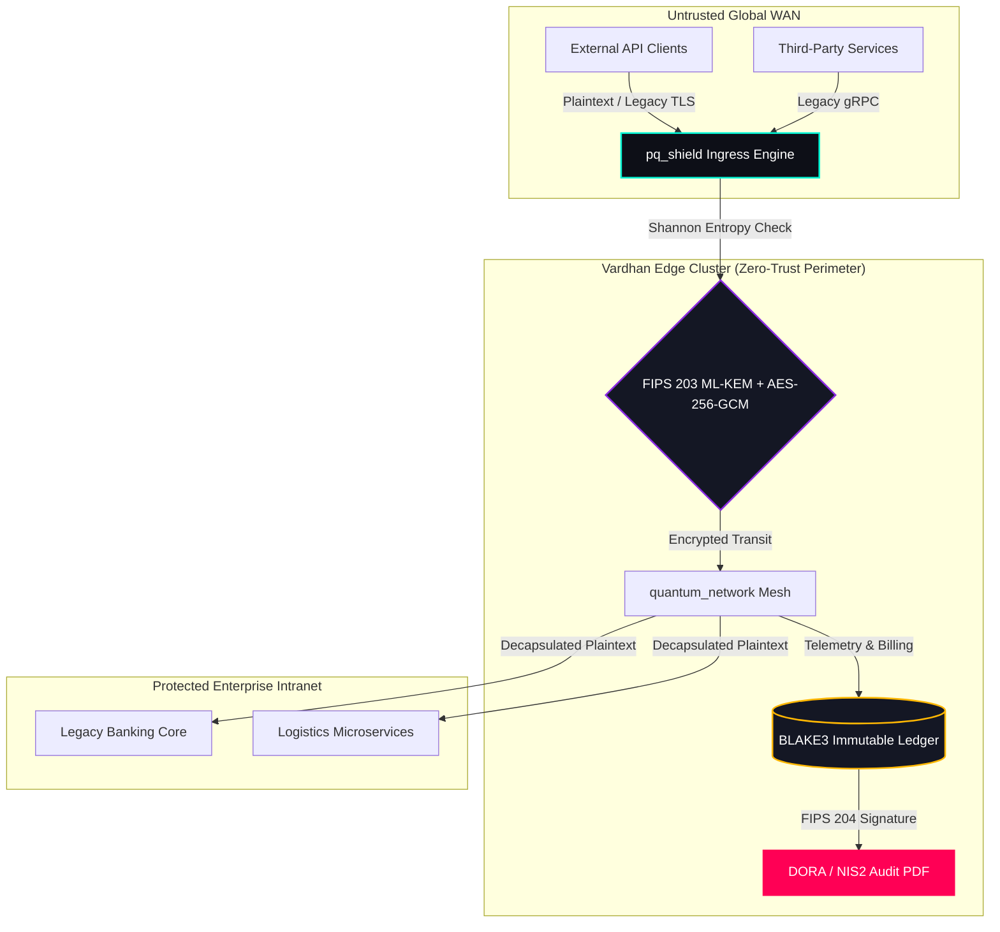
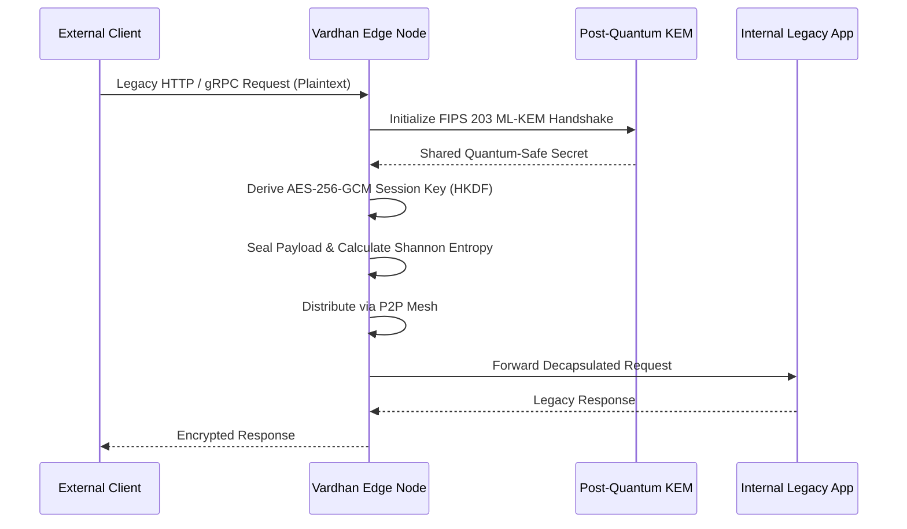
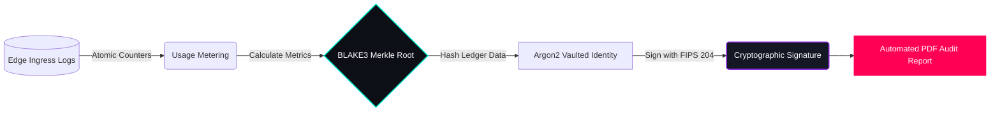

# Vardhan Post-Quantum Ingress Engine


The **Vardhan Post-Quantum Ingress Engine** is an enterprise-grade cryptographic interception gateway deployed by Tier-1 financial institutions, global logistics networks, and sovereign critical infrastructure. Engineered as a zero-touch reverse proxy, the engine transparently upgrades legacy HTTP, TCP, and gRPC traffic to NIST-standardized Post-Quantum Cryptography (**FIPS 203 ML-KEM** and **FIPS 204 ML-DSA**).

Designed for seamless enterprise integration, the Vardhan engine enables immediate cryptographic modernization and strict adherence to **DORA (Article 9)** and **NIS2 (Article 21)** regulatory mandates—without requiring source code modifications to existing downstream microservices.

---

## 🏛️ Enterprise Architecture

The Vardhan network operates as a decentralized, fault-tolerant edge cluster, engineered in memory-safe asynchronous Rust for deterministic, sub-millisecond latency.



### 1. Zero-Touch Edge Gateway
* **Transparent Interception:** Operates as an invisible edge interceptor, dynamically enveloping plaintext transit in AES-256-GCM utilizing HKDF-SHA-256 session keys derived exclusively via ML-KEM post-quantum lattices.
* **Ultra-High Throughput:** Benchmarked at **> 1.7 Million requests per second**, utilizing lock-free atomic buffers and asynchronous multi-threading to ensure zero degradation to stringent SLA latency requirements.
* **Cryptographic Finality:** Continuously monitors Shannon Entropy metrics (targeting ~7.998 bits/byte) to cryptographically guarantee transit randomness and mitigate deep packet inspection vulnerabilities.



### 2. High-Availability State Replication
* **Decentralized Epidemic Mesh:** Core edge nodes are orchestrated via a proprietary, loop-free P2P gossip protocol. This dynamic discovery mesh ensures instantaneous state replication and self-healing fault tolerance across global, multi-cloud deployment regions.

### 3. Immutable SaaS Metering Ledger
* **Cryptographic Write-Ahead Logging:** Intercepted telemetry is hashed via high-performance BLAKE3 Merkle chains, creating an immutable, verifiable ledger of edge activity.
* **Multi-Tenant Isolation:** Safely orchestrates dynamic connection mapping and cryptographic SLA tiering utilizing Argon2-hardened key vaults, ensuring strict data residency and tenant isolation for enterprise SaaS environments.

### 4. Automated Compliance & Telemetry
* **CISO Command Center:** A highly-dense telemetry center provides Site Reliability Engineering (SRE) teams with real-time visibility into Shannon Entropy metrics, quorum finality, and cryptanalytic differentials.
* **Automated DORA / NIS2 Audit Export:** The engine dynamically parses the cryptographic ledger to generate verifiable, mathematically signed PDF Audit Reports, streamlining CISO and Risk Committee sign-offs.



---

## ⚡ Deployment Topology

The Vardhan Post-Quantum Ingress Engine is distributed as a zero-attack-surface `distroless` OCI container image, built exclusively for orchestration via Kubernetes Helm charts or isolated bare-metal edge environments.

```bash
# Enterprise Edge Initialization via Vardhan Deployment Engine
./scripts/deploy_edge_node.sh TENANT_LLOYDS_BANK_01
```

For enterprise procurement, architectural deep dives, and localized CISO onboarding, contact the **Vardhan Technologies Enterprise Deployment Team**.

---

## 🧪 Development & Testing

### P3.8 Raft High-Availability Validation

The `ha_cluster` crate implements a from-scratch Raft consensus engine with a custom AEAD-secured TCP transport (`AeadTransport`). All failure/recovery scenarios are validated through deterministic integration tests using a test-only `NetworkController` fault-injection layer that sits between the `RaftRpcClient` and `AeadTransport`.

**Test suite (`ha_cluster/tests/raft_l3_failure.rs`):**
- **10 single failure tests** — persistence/torn-write, leader crash, follower crash + real listener restart, old-leader-returns fencing, network partition, partition healing, stale/delayed RPC, duplicate request idempotency, rapid leader churn (3 rounds), slow peer
- **4 × 10× repetition tests** — leader crash (10/10), follower crash (10/10), partition/heal (10/10), stale RPC (10/10)
- **All 14 tests pass** with `--test-threads=1`

**P3.8 Step 3 status: ✅ COMPLETE**

```bash
# Run all Raft failure tests (sequential, fault-injection)
CARGO_TARGET_DIR=/tmp/vardhan-quantum-target \
  cargo test -p ha_cluster --test raft_l3_failure -- --test-threads=1
```

**P3.8 Step 3.1 status: ✅ COMPLETE** — Hardening pass covering real process crash (SIGKILL subprocess), durable log persistence & replay, majority progress with timed-out slow peer via `FuturesUnordered`, post-timeout stale response rejection, stale-term rejection, duplicate RPC idempotency, stale worker replacement, bidirectional partition proof, address-change recovery, and crash-during-commit. See `docs/P3.8_STEP3.1_VERIFICATION_REPORT.md`.

---
*© Vardhan Technologies &mdash; Securing the critical infrastructure of tomorrow against the cryptographically relevant quantum computers of today.*
