# VARDHAN QUANTUM
# ENTERPRISE IDENTITY + ACCESS ARCHITECTURE

**Document Version**: 1.0  
**Status**: ARCHITECTURE PHASE — NO SOURCE CODE HAS BEEN MODIFIED  
**Base Commit**: `03f63ef` (docs: add backend architecture truth audit)  
**Preceding Document**: `docs/BACKEND_ARCHITECTURE_AUDIT.md`  
**Date**: September 2026  

> **CRITICAL INSTRUCTION**: This document describes a proposed future architecture.
> Every section distinguishes **CURRENT** (what exists in source code today) from
> **PROPOSED** (what the engineering team will implement in future phases).
> Do not treat proposed architecture as existing functionality.

---

## 1. Executive Summary

Vardhan Quantum requires a single, unified enterprise identity and access control
system that serves four distinct user personas operating the same post-quantum
security platform. This architecture document defines the complete design for:

- **ONE** identity model
- **ONE** authentication system
- **ONE** authorization system
- **FOUR** persona-differentiated dashboard experiences
- **ONE** shared post-quantum technical platform

The current backend provides a working cryptographic foundation
(`core_crypto`, `audit_ledger`, `proxy_engine`, `pq_shield`, `ha_cluster`,
`auth_service`) and a functional RBAC system. The gaps identified in the
preceding audit — node-local sessions, node-local API keys, persisted-only
settings, and the decoupled Raft application boundary — define the
implementation roadmap.

This document does not fix those gaps. It designs the architecture that
future phases will implement.

---

## 2. Current Audit Findings (Source Evidence)

The following facts are directly verified in source code. They are not
assumptions. They are not representations of proposed architecture.

### 2.1 Authentication — CURRENT STATE

**Source**: `backend/auth_service/src/`

| Component | Implementation | Source Location |
| :--- | :--- | :--- |
| Password hashing | Argon2id: $m=65536, t=3, p=4$, 32-byte OsRng salt | `credentials.rs` |
| Timing-safe username check | Sentinel hash executed for unknown users | `credentials.rs:81-89` |
| Session token | 32 bytes OsRng → 64-char hex string | `session.rs:41-44` |
| Session ID | `sess_` + 8 bytes OsRng → 16-char hex | `session.rs:164` |
| Hard session timeout | `SESSION_HARD_EXPIRY_SECS = 28800` (8 hours) | `session.rs:23` |
| Idle session timeout | `SESSION_IDLE_TIMEOUT_SECS = 1800` (30 min) | `session.rs:25` |
| Rate limiting | `MAX_FAILURES = 10`, `WINDOW = 15 min` in-memory DashMap | `rate_limit.rs` |

### 2.2 RBAC — CURRENT STATE

**Source**: `backend/auth_service/src/authorization.rs`

Three roles exist:

| Role | String | Permissions |
| :--- | :--- | :--- |
| `Admin` | `ciso_admin` | All 11 permissions |
| `Operator` | `cluster_operator` | ReadDashboard, ReadSessions, RevokeSession, DrainCluster, UpdateProfile, ChangePassword |
| `User` | `user` | ReadDashboard, UpdateProfile, ChangePassword |

Eleven permissions exist (current `Permission` enum):
`ReadDashboard`, `ReadSessions`, `RevokeSession`, `FlushSessions`,
`UpdateProfile`, `ChangePassword`, `UpdateSettings`, `ManageApiKeys`,
`DrainCluster`, `RebootCluster`, `LedgerAdmin`.

> **Note**: Role aliases map `ciso_admin`, `security_admin`, `root` → Admin;
> `cluster_operator`, `ops` → Operator.

### 2.3 Authentication Middleware — CURRENT STATE

**Source**: `backend/pq_shield/src/admin.rs:51-120`, `backend/auth_service/src/lib.rs:673-706`

The authentication middleware checks in this exact order:

```
1. OPTIONS pass-through (CORS preflight)
2. Public path bypass: /api/v1/auth/login, /metrics
3. Extract Bearer token from Authorization header or ?token= query param
4. Session store DashMap lookup → sliding window update
5. Constant-time check against VARDHAN_ADMIN_TOKEN env var
6. BLAKE3 hash lookup for vq_live_ prefixed API keys
```

### 2.4 Session Architecture — CURRENT GAPS

**Source**: `backend/auth_service/src/session.rs`

```
SessionStore {
  inner:   Arc<DashMap<token_str, SessionEntry>>   — lost on restart
  by_id:   Arc<DashMap<session_id, token_str>>     — lost on restart
  revoked: Arc<DashMap<session_id, SessionView>>   — NO TTL, NO BOUND (RISK)
}
```

**Gap 1**: Sessions are `NODE_LOCAL`. Process restart destroys all sessions.  
**Gap 2**: A session created on Node A cannot be validated by Node B.  
**Gap 3**: The `revoked` map grows without bound — $O(N)$ memory leak risk.

### 2.5 API Key Architecture — CURRENT GAPS

**Source**: `backend/auth_service/src/api_key.rs`

```
Key format:  vq_live_<64-hex chars>
Storage:     apikey:<id> → ApiKeyRecord (in Sled, local filesystem)
Hash index:  apikey_hash:<blake3(secret)> → id (in Sled, local filesystem)
```

**Gap 4**: Sled database is node-local. Keys created on Node A do not exist on Node B.

### 2.6 Settings Runtime — CURRENT GAPS

**Source**: `backend/auth_service/src/settings.rs`

`PUT /api/v1/settings` saves to Sled key `settings:v1`. But:

| Setting | Runtime Consumer | Runtime Consumed? |
| :--- | :--- | :--- |
| `max_connections` | `pq_shield` static constant | **NO** |
| `request_timeout_secs` | `pq_shield` startup config | **NO** |
| `require_pqc_handshake` | `pq_shield` startup config | **NO** |
| `min_password_length` | `credentials.rs` hardcode `12` | **NO** |
| `session_idle_timeout_secs` | `SESSION_IDLE_TIMEOUT_SECS = 1800` constant | **NO** |
| `session_hard_timeout_secs` | `SESSION_HARD_EXPIRY_SECS = 28800` constant | **NO** |
| `max_failed_logins` | `RateLimiter MAX_FAILURES = 10` constant | **NO** |
| `heartbeat_interval_ms` | `ha_cluster` internal constant | **NO** |
| `drain_timeout_secs` | Read at drain execution | **PARTIAL** |

**Gap 5**: Settings are `PERSISTED_ONLY`. All runtime behavior uses compile-time constants.

### 2.7 Raft Boundary — CURRENT GAP

**Source**: `backend/ha_cluster/src/raft.rs`

`RaftNode::submit_entry(entry: LogEntry)` is implemented and tested, but is
**not called by** `pq_shield`, `auth_service`, or `audit_ledger` during normal
runtime operation.

**Gap 6**: Application state (users, sessions, API keys, settings, audit
ledger) is not routed through Raft log replication.

### 2.8 Current Audit Event Types

**Source**: `backend/auth_service/src/audit.rs`, `backend/pq_shield/src/admin.rs`

All current audit events:
`LoginFailed`, `LoginSucceeded`, `Logout`, `ProfileUpdated`,
`PasswordChanged`, `AdministrativeOperationFailed`, `SettingsUpdated`,
`SessionRevoked`, `SessionsFlushed`, `ApiKeyCreated`, `ApiKeyRevoked`,
`ClusterDrainRequested`, `ClusterDrainCompleted`, `ClusterRebootRequested`

---

## 3. Product Principles

```
ONE authentication system.
ONE identity model.
ONE authorization system.
FOUR primary personas.
MULTIPLE dashboard experiences.
ONE shared technical platform.

Persona  ≠  Role.
Persona  ≠  Authorization boundary.
Role     =  Class of access.
Permission = Gate on a specific action.
```

**Persona** answers: "How does this user want to work with the system?"  
**Role** answers: "What class of access does this user have?"  
**Permission** answers: "Can this user perform this specific action?"

The backend is always the authorization authority.  
Navigation is not a security boundary.  
Frontend filtering is presentation only.

---

## 4. Four Personas

### 4.1 EXECUTIVE

| Property | Value |
| :--- | :--- |
| Typical users | Director, CIO, CTO, CISO, Security Leadership |
| Default workspace | COMMAND CENTER |
| Primary concern | Posture, availability, risk, major events |
| Technical depth | Optional — drill-down is permitted by RBAC |

The Executive persona is **NOT technically restricted**. If the user's Role
grants technical access, an Executive can drill into Raft terms, transport
frames, and cryptographic diagnostics. The persona controls the *default
landing experience*, not the permission boundary.

### 4.2 SECURITY & IT

| Property | Value |
| :--- | :--- |
| Typical users | IT Director, Security Manager, Platform Engineer |
| Default workspace | SECURITY CENTER / INFRASTRUCTURE |
| Primary concern | Cluster health, crypto status, identity, configuration |

### 4.3 SOC / OPERATOR

| Property | Value |
| :--- | :--- |
| Typical users | SOC Analyst, NOC Operator, On-call Engineer |
| Default workspace | LIVE OPERATIONS |
| Primary concern | Live events, sessions, proxy traffic, errors, failover |

### 4.4 AUDITOR

| Property | Value |
| :--- | :--- |
| Typical users | Internal/External Auditor, Compliance, Evidence Reviewer |
| Default workspace | EVIDENCE CENTER |
| Primary concern | Audit ledger, evidence bundles, verification, export |
| Default access | Read-oriented; no cluster drain or API key management |

---

## 5. Identity Architecture

### 5.1 Identity Model

Every authenticated entity in Vardhan Quantum has:

```
Identity {
  username:            String        (primary identifier)
  display_name:        String        (human-readable label)
  email:               Option<String>
  role:                Role          (authorization class)
  persona:             Persona       (dashboard experience selector)
  mfa_enrolled:        bool          (PROPOSED: not yet implemented)
  mfa_methods:         Vec<MfaMethod>(PROPOSED: not yet implemented)
  node_id:             String        (issuing node, for session context)
  created_at_ms:       u128
  updated_at_ms:       u128
}
```

**Current** (`AdminProfile` in `profile.rs`):
```rust
pub struct AdminProfile {
    pub username: String,
    pub display_name: String,
    pub email: String,
    pub role: String,
    pub updated_at_ms: u128,
}
```

**Missing today**: `persona` field, `mfa_enrolled`, `mfa_methods`.

### 5.2 Persona Storage

Persona is a **user preference** field stored on the `AdminProfile`, not a
role assignment. It defaults to a contextual selection based on Role.

**Default Persona by Role** (PROPOSED):

| Role | Default Persona |
| :--- | :--- |
| `Admin` | `EXECUTIVE` or user-selected |
| `Operator` | `SOC` |
| `User` | `AUDITOR` |

The user may switch personas at login or from the dashboard if their role
grants access to multiple persona experiences.

---

## 6. Authentication

### 6.1 Authentication Flow (Proposed Design)

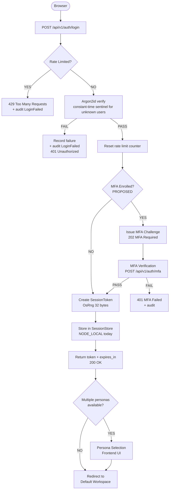

### 6.2 Authentication Token Hierarchy

Three token types are accepted by the current middleware (in priority order):

| Priority | Token Type | Format | Resolution | Authorization |
| :--- | :--- | :--- | :--- | :--- |
| 1 | Session Token | 64-char hex | DashMap lookup | Role from Sled profile |
| 2 | Bootstrap Admin | Any string | Constant-time env match | Hardcoded Admin |
| 3 | API Key | `vq_live_<64-hex>` | BLAKE3 hash Sled lookup | Hardcoded Admin |

> **Security Note**: API keys are currently assigned `Role::Admin` regardless
> of context (see `lib.rs:700`). The proposed architecture should support
> scoped API key roles.

---

## 7. MFA Architecture

### 7.1 Current State

**`NOT_IMPLEMENTED`**. No MFA exists in any crate today.

### 7.2 Proposed MFA Model

Design for extensibility. Implement TOTP first.

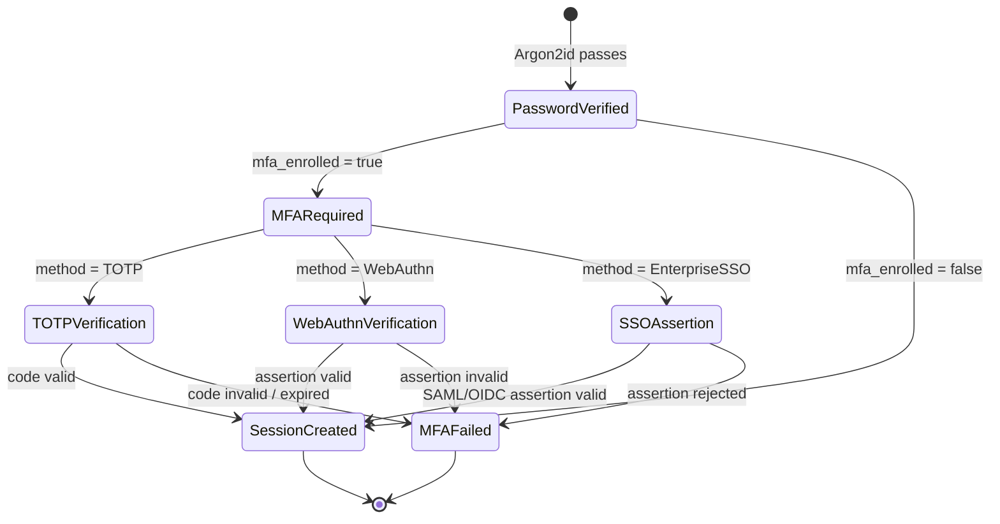

### 7.3 MFA Method Registry (Proposed)

| Method | Priority | Status | Notes |
| :--- | :--- | :--- | :--- |
| TOTP (RFC 6238) | 1 | `PROPOSED` — Phase 2 | Implement with `totp-rs` |
| WebAuthn / Passkeys | 2 | `FUTURE` | FIDO2, hardware security keys |
| Enterprise SSO (SAML/OIDC) | 3 | `FUTURE` | Required for tenant model |
| Recovery codes | 4 | `PROPOSED` — Phase 2 | 8 single-use codes, bcrypt hashed |

### 7.4 MFA Enrollment Flow

```
POST /api/v1/auth/mfa/enroll         — initiate enrollment, returns QR/seed
POST /api/v1/auth/mfa/enroll/verify  — verify first TOTP code to confirm
POST /api/v1/auth/mfa/disable        — requires current MFA + Admin confirmation
GET  /api/v1/auth/mfa/status         — returns enrolled methods
POST /api/v1/auth/mfa/recovery       — generate new recovery codes
```

All MFA events must emit audit records.

---

## 8. Persona & Workspace Architecture

### 8.1 Persona Selection Flow

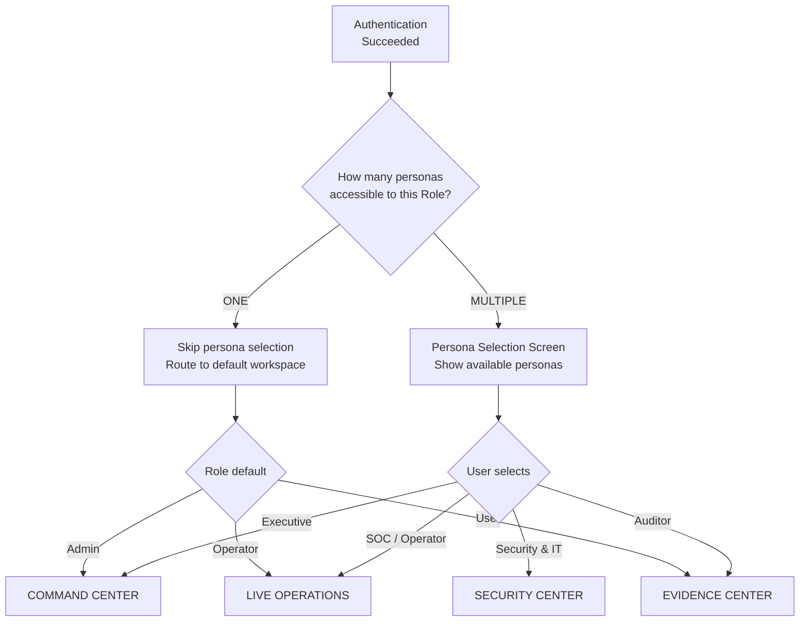

### 8.2 Persona → Default Workspace Mapping

| Persona | Default Route | Primary API Calls | Data Classification |
| :--- | :--- | :--- | :--- |
| Executive | `/` (Command Center) | `/cluster/status`, `/metrics`, `/raft/status` | `BACKEND_DERIVED` |
| Security & IT | `/security`, `/infrastructure` | `/metrics`, `/cluster/peers`, `/crypto/status` | `BACKEND_DERIVED` |
| SOC / Operator | `/` (Live Operations) | `/events` (SSE), `/sessions`, `/metrics` | `BACKEND_DERIVED` |
| Auditor | `/evidence` | `/ledger/status`, `/ledger/export` | `BACKEND_DERIVED` |

---

## 9. RBAC Architecture

### 9.1 Core Design Decision: Persona ≠ Role

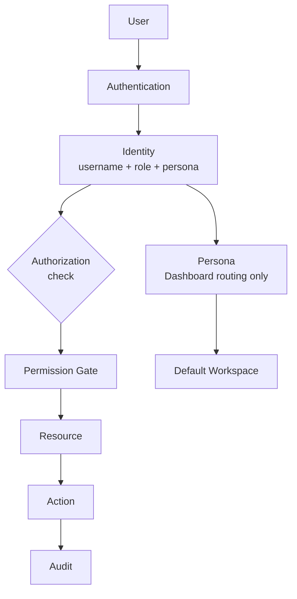

The `Role` is the authorization boundary. The `Persona` is presentation routing only.

### 9.2 Proposed Expanded Role Structure

The current three roles (`Admin`, `Operator`, `User`) remain foundational.
New roles are additive, not replacements.

| Role | Proposed String | Authorization Level | Maps to Persona Default |
| :--- | :--- | :--- | :--- |
| `Admin` | `ciso_admin` | Full superuser (unchanged) | Executive |
| `SecurityManager` | `security_manager` | `PROPOSED` | Security & IT |
| `Operator` | `cluster_operator` | Operational (unchanged) | SOC |
| `Auditor` | `auditor` | Read-oriented audit access | Auditor |
| `User` | `user` | Self-management (unchanged) | User-defined |
| `Developer` | `developer` | `PROPOSED`: Technical mode access | Any |

> **Implementation Note**: `Role::from_str` in `authorization.rs` already
> handles `ciso_admin` and `cluster_operator` as aliases. New role aliases
> can be added to that match arm without breaking existing deployments.

### 9.3 RBAC Flow

```mermaid
flowchart LR
    A[Request] --> B[Auth Middleware]
    B --> C{Token type}
    C -- Session --> D[DashMap lookup\nget username]
    C -- Admin Token --> E[env constant-time check]
    C -- API Key --> F[BLAKE3 Sled lookup]
    D --> G[Sled profile lookup\nget role string]
    G --> H[Role::from_str\nRole enum]
    E --> H
    F --> H
    H --> I[AuthenticatedUser\nusername + role]
    I --> J{Permission gate\nuser.can(Permission)}
    J -- GRANTED --> K[Handler executes]
    J -- DENIED --> L[403 Forbidden\n+ audit AdministrativeOperationFailed]
    K --> M[Audit event\nemit_admin_audit]
```

---

## 10. Expanded Permission Matrix

The proposed permission set expands the current 11 permissions to 30.
Every permission below maps to a specific resource + action pair.

### 10.1 Full Proposed Permission Enum

```rust
// PROPOSED — not yet implemented
pub enum Permission {
    // Dashboard & Read
    ReadDashboard,          // EXISTS: all roles
    ReadCluster,            // PROPOSED: cluster status, peer list
    ReadNodes,              // PROPOSED: per-node health and diagnostics
    ReadRegions,            // PROPOSED: regional topology
    ReadSecurity,           // PROPOSED: crypto status, security events
    ReadCryptography,       // PROPOSED: PQ identity, algorithm status
    ReadTransport,          // PROPOSED: AeadTransport state, frame metrics
    ReadIdentity,           // PROPOSED: user list (admin only)
    ReadRaft,               // PROPOSED: Raft term, role, commit index
    ReadReplication,        // PROPOSED: Raft log state, peer match index
    ReadMetrics,            // PROPOSED: Prometheus metrics
    ReadRuntime,            // PROPOSED: runtime config, connection limits
    ReadNetwork,            // PROPOSED: proxy frame counters, latency
    ReadPersistence,        // PROPOSED: ledger height, Sled stats
    ReadDiagnostics,        // PROPOSED: technical diagnostics

    // Sessions
    ReadSessions,           // EXISTS: Admin, Operator
    RevokeSession,          // EXISTS: Admin, Operator (+ self)
    FlushSessions,          // EXISTS: Admin only

    // Profile
    UpdateProfile,          // EXISTS: Admin, User
    ChangePassword,         // EXISTS: Admin, User

    // Settings
    ReadSettings,           // PROPOSED: separate from UpdateSettings
    UpdateSettings,         // EXISTS: Admin only

    // API Keys
    ManageApiKeys,          // EXISTS: Admin only

    // Cluster ops
    DrainCluster,           // EXISTS: Admin, Operator
    RebootCluster,          // EXISTS: Admin only

    // Audit
    ReadAuditLedger,        // PROPOSED: Auditor + Admin
    ManageAuditLedger,      // PROPOSED: Admin only (export, rotation)
    ReadEvidence,           // PROPOSED: evidence bundle access
    VerifyEvidence,         // PROPOSED: verify hash chain signatures

    // Technical / Developer
    ManageDeveloperSettings, // PROPOSED: developer settings panel
    ReadRuntime,             // (same as above — merged)
}
```

### 10.2 Role → Permission Matrix (Proposed)

| Permission | Admin | SecurityManager | Operator | Auditor | User | Developer |
| :--- | :---: | :---: | :---: | :---: | :---: | :---: |
| ReadDashboard | ✅ | ✅ | ✅ | ✅ | ✅ | ✅ |
| ReadCluster | ✅ | ✅ | ✅ | ✅ | ❌ | ✅ |
| ReadNodes | ✅ | ✅ | ✅ | ❌ | ❌ | ✅ |
| ReadSecurity | ✅ | ✅ | ✅ | ❌ | ❌ | ✅ |
| ReadCryptography | ✅ | ✅ | ❌ | ❌ | ❌ | ✅ |
| ReadTransport | ✅ | ✅ | ❌ | ❌ | ❌ | ✅ |
| ReadRaft | ✅ | ✅ | ✅ | ❌ | ❌ | ✅ |
| ReadReplication | ✅ | ✅ | ❌ | ❌ | ❌ | ✅ |
| ReadMetrics | ✅ | ✅ | ✅ | ❌ | ❌ | ✅ |
| ReadRuntime | ✅ | ✅ | ❌ | ❌ | ❌ | ✅ |
| ReadDiagnostics | ✅ | ✅ | ❌ | ❌ | ❌ | ✅ |
| ReadSessions | ✅ | ✅ | ✅ | ❌ | Self only | ❌ |
| RevokeSession | ✅ | ✅ | ✅ | ❌ | Self only | ❌ |
| FlushSessions | ✅ | ❌ | ❌ | ❌ | ❌ | ❌ |
| UpdateProfile | ✅ | ✅ | ✅ | ✅ | ✅ | ✅ |
| ChangePassword | ✅ | ✅ | ✅ | ✅ | ✅ | ✅ |
| ReadSettings | ✅ | ✅ | ✅ | ❌ | ❌ | ✅ |
| UpdateSettings | ✅ | ❌ | ❌ | ❌ | ❌ | ❌ |
| ManageApiKeys | ✅ | ❌ | ❌ | ❌ | ❌ | ❌ |
| DrainCluster | ✅ | ✅ | ✅ | ❌ | ❌ | ❌ |
| RebootCluster | ✅ | ❌ | ❌ | ❌ | ❌ | ❌ |
| ReadAuditLedger | ✅ | ✅ | ❌ | ✅ | ❌ | ❌ |
| ManageAuditLedger | ✅ | ❌ | ❌ | ❌ | ❌ | ❌ |
| ReadEvidence | ✅ | ✅ | ❌ | ✅ | ❌ | ❌ |
| VerifyEvidence | ✅ | ✅ | ❌ | ✅ | ❌ | ❌ |
| ManageDeveloperSettings | ✅ | ✅ | ❌ | ❌ | ❌ | ✅ |

---

## 11. Session Architecture

### 11.1 Current Reality

```
NODE_LOCAL: Sessions in RAM (DashMap). Lost on restart. Not cross-node.
```

### 11.2 Session Model Comparison

| Option | Security | Failover | Revocation | Latency | Complexity | Recommendation |
| :--- | :--- | :--- | :--- | :--- | :--- | :--- |
| **A. Sticky Sessions** | Medium | Poor: Session node failure = re-login | Node-local immediate | Low | Low | ❌ Unsuitable for HA |
| **B. Distributed Store (Redis/Valkey)** | High | Good: Any node reads shared store | Cluster-wide immediate | Low-Medium | Medium | ✅ Practical short-term |
| **C. Stateless Signed Tokens + Revocation List** | High | Excellent: No shared session state | Revocation list needed | Very Low | High | ✅ Long-term target |
| **D. Raft-Replicated Sessions** | Very High | Excellent: Consensus-guaranteed | Cluster-wide immediate | Medium-High | Very High | ⚠️ Overkill for sessions |

**Recommended Architecture**: Option C (Stateless Signed Tokens) with a
cluster-authoritative revocation index.

**Rationale**:
- Sessions themselves are ephemeral. They do not need strong Raft consistency.
- Raft consensus for every API request would add 100-500ms of consensus latency.
- A signed JWT-equivalent token with short TTL (8h hard, 30m idle) allows any
  node to validate independently.
- A cluster-authoritative revocation set (via Raft or distributed cache) ensures
  immediate revocation propagates without sticky routing.

**Revoked DashMap Unbounded Growth Fix** (Gap 3, immediate priority):

```rust
// PROPOSED: replace revoked: Arc<DashMap<...>> with bounded TTL cache
// Use a time-ordered BTreeMap or lru::LruCache with TTL eviction
// Entries expire at session hard_timeout + 10-minute grace period
```

### 11.3 Session Lifecycle

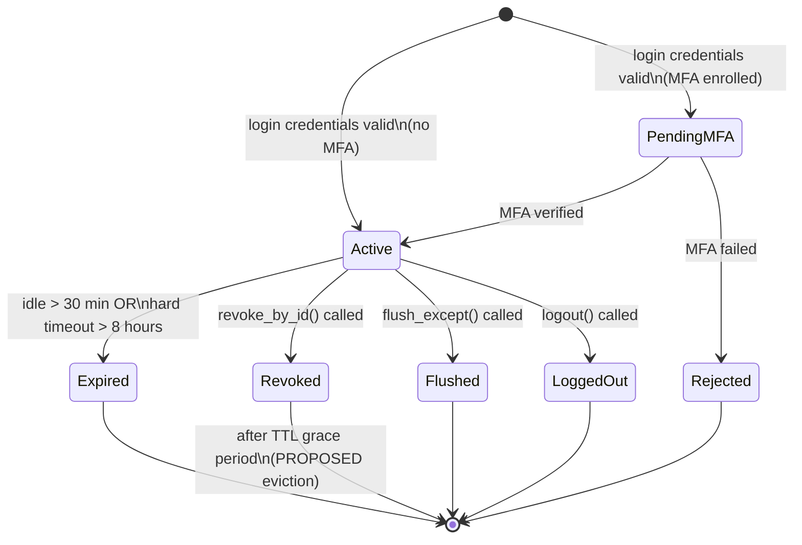

---

## 12. API Key Architecture

### 12.1 Current Reality

```
NODE_LOCAL: Sled database per-node (data/auth_db).
Key creation on Node A → Node B has no record of it.
```

### 12.2 API Key Lifecycle

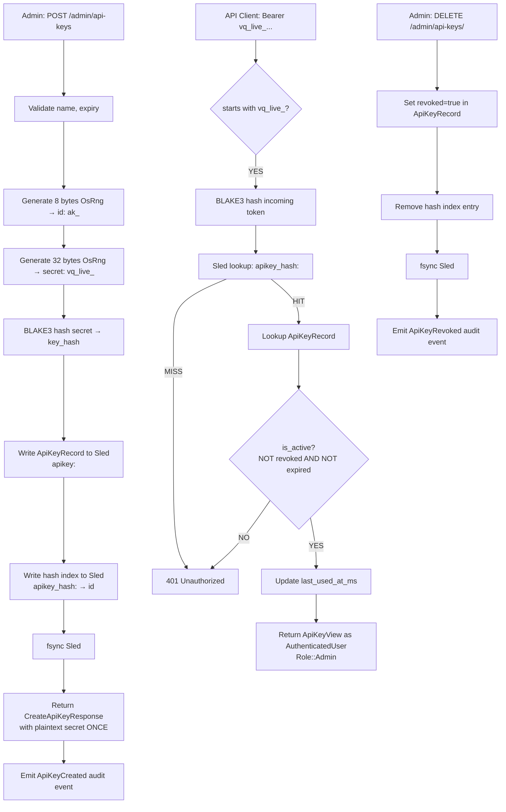

### 12.3 Proposed Distributed API Key Architecture

**Current gap**: Sled is node-local. Cross-node authentication fails for keys
created on a different node.

**Proposed architecture**: Route API key writes through Raft state machine.

```
POST /admin/api-keys
  ↓
hash secret
  ↓
submit LogEntry to RaftNode::submit_entry
  ↓
Raft replicates to quorum
  ↓
State machine applies → writes to all nodes' Sled databases
  ↓
Return CreateApiKeyResponse to caller
```

This design:
- Never replicates plaintext secrets (only BLAKE3 hash and metadata)
- Ensures eventual consistency across all cluster nodes
- Uses the existing `RaftNode::submit_entry` API
- Requires implementing the application state machine (`apply_committed_entries`)

### 12.4 API Key Scoping (Proposed)

Current behavior: all API keys receive `Role::Admin` (`lib.rs:700`).

Proposed: API keys should carry an explicit role and scope.

```rust
// PROPOSED
pub struct ApiKeyRecord {
    // ... existing fields ...
    pub role: String,              // "admin", "operator", "auditor"
    pub scopes: Vec<Permission>,   // explicit permission list
}
```

---

## 13. Technical Mode

### 13.1 Principle

Technical Mode is a **visibility toggle**, not a security boundary.

```
Technical Mode OFF = simplified presentation (current default)
Technical Mode ON  = full technical metadata visible where permitted by RBAC
```

Persona does NOT determine if Technical Mode exists.  
**RBAC (Permission::ReadRuntime, ReadDiagnostics)** determines access to it.

### 13.2 Technical Mode Flow

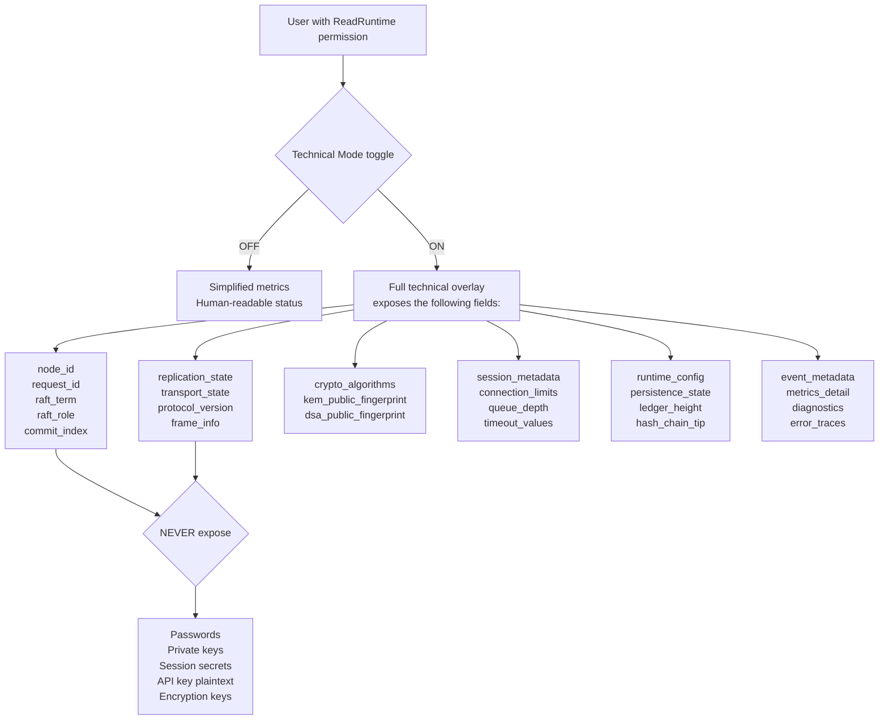

### 13.3 Technical Mode State Storage

Technical Mode preference is stored in `UserSettings`:

```rust
// PROPOSED addition to UserSettings struct
pub struct UserSettings {
    pub theme: String,
    pub refresh_interval_secs: u32,
    pub alert_notifications: bool,
    pub technical_mode: bool,    // PROPOSED
}
```

The existing settings persistence (`settings:v1` in Sled) can carry this
field without schema migration.

---

## 14. Developer Settings Architecture

### 14.1 Overview

A dedicated developer settings panel provides authorized users read and
limited write access to runtime configuration categories.

### 14.2 Settings Categories (Proposed)

| Category | Settings | Permission |
| :--- | :--- | :--- |
| Runtime | log_level, max_connections, request_timeout_secs | `ManageDeveloperSettings` |
| Network | proxy ports, upstream targets | `ManageDeveloperSettings` |
| Proxy | buffer sizes, retry policy | `ManageDeveloperSettings` |
| Transport | AeadTransport frame limits | `ManageDeveloperSettings` |
| Cryptography | algorithm names (read-only) | `ReadCryptography` |
| PQC | kem_algorithm, dsa_algorithm (read-only) | `ReadCryptography` |
| Raft | heartbeat_interval_ms, election_timeout | `ManageDeveloperSettings` |
| Cluster | region, drain_timeout_secs | `ManageDeveloperSettings` |
| Security | require_pqc_handshake, min_password_length | `UpdateSettings` |
| Sessions | idle_timeout, hard_timeout | `UpdateSettings` |
| Audit Ledger | ledger path (read-only) | `ReadPersistence` |
| Observability | metrics endpoints | `ReadMetrics` |
| Logging | log format, trace level | `ManageDeveloperSettings` |
| Rate Limits | max_failed_logins | `UpdateSettings` |
| Feature Flags | technical_mode enabled | `ManageDeveloperSettings` |

### 14.3 Settings Metadata Model (Proposed)

Every developer setting has associated metadata:

```
DevSettingMetadata {
  name:             String
  category:         SettingCategory
  description:      String
  current_value:    serde_json::Value
  default_value:    serde_json::Value
  type:             SettingType  (String, Integer, Boolean, Enum)
  allowed_values:   Option<Vec<Value>>
  scope:            SettingScope  (Node, Cluster)
  mutability:       Mutability
  permission:       Permission
  restart_required: bool
  audit_required:   bool
}

enum Mutability {
  ReadOnly,          // immutable at runtime
  SafeRuntimeEdit,   // can be changed without restart
  RestartRequired,   // requires node restart
  AdminOnly,         // requires Admin role
  Dangerous,         // requires step-up confirmation
  Immutable,         // compile-time or crypto identity
  NotImplemented,    // PERSISTED_ONLY — not wired to runtime yet
}
```

---

## 15. Settings Runtime Model

### 15.1 Complete Field Classification (Current vs Proposed)

| Setting | Persisted | Validated | Runtime Consumed | Mutability | Gap |
| :--- | :--- | :--- | :--- | :--- | :--- |
| `theme` | ✅ | ✅ | ✅ Frontend | `SafeRuntimeEdit` | None |
| `refresh_interval_secs` | ✅ | ✅ | ✅ Frontend | `SafeRuntimeEdit` | None |
| `alert_notifications` | ✅ | ❌ | ❌ | `SafeRuntimeEdit` | Gap |
| `log_level` | ✅ | ✅ | ❌ | `NotImplemented` | **Gap 5** |
| `max_connections` | ✅ | ✅ | ❌ | `NotImplemented` | **Gap 5** |
| `request_timeout_secs` | ✅ | ❌ | ❌ | `NotImplemented` | **Gap 5** |
| `require_pqc_handshake` | ✅ | ❌ | ❌ | `RestartRequired` | **Gap 5** |
| `min_password_length` | ✅ | ✅ (`>= 12`) | ❌ | `NotImplemented` | **Gap 5** |
| `session_idle_timeout_secs` | ✅ | ✅ (`>= 60`) | ❌ | `NotImplemented` | **Gap 5** |
| `session_hard_timeout_secs` | ✅ | ❌ | ❌ | `NotImplemented` | **Gap 5** |
| `max_failed_logins` | ✅ | ❌ | ❌ | `NotImplemented` | **Gap 5** |
| `heartbeat_interval_ms` | ✅ | ✅ (`>= 50`) | ❌ | `NotImplemented` | **Gap 5** |
| `drain_timeout_secs` | ✅ | ❌ | ✅ Partial | `SafeRuntimeEdit` | Partial |
| `region` | ✅ | ❌ | ❌ | `NotImplemented` | **Gap 5** |
| `node_id` | ✅ | Immutable | Read-only | `Immutable` | None |
| `signer_pub_fingerprint` | ✅ | Immutable | Read-only | `Immutable` | None |
| `kem_algorithm` | ✅ | Immutable | Compile-time | `Immutable` | None |
| `dsa_algorithm` | ✅ | Immutable | Compile-time | `Immutable` | None |

### 15.2 Runtime Wiring Strategy (Proposed — Phase 5)

Use `tokio::sync::watch` channels to broadcast live setting changes:

```
PUT /api/v1/settings
  ↓
validate + save to Sled
  ↓
settings_watch_tx.send(new_settings)
  ↓
pq_shield rate limiter reads new max_failed_logins
SessionStore timeout checker reads new session_idle_timeout_secs
ha_cluster heartbeat reads new heartbeat_interval_ms
```

---

## 16. State Ownership Classification

### 16.1 State Classification Diagram

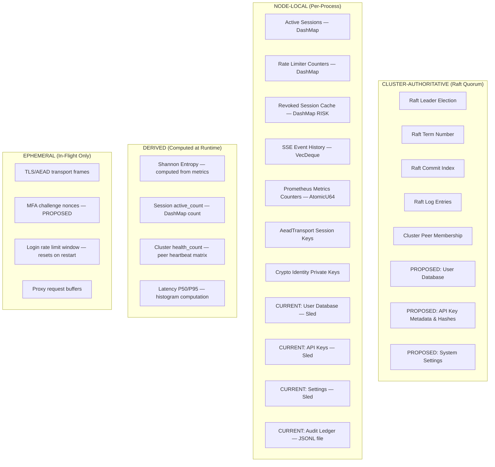

### 16.2 State Ownership Detail Table

| State | Owner | Persistence | Replication | Consistency Req | On Node Failure |
| :--- | :--- | :--- | :--- | :--- | :--- |
| Crypto identity (private keys) | Node-Local | Encrypted file | None — per-node identity | Immutable | Key never leaves node |
| Active sessions | Node-Local (current) | RAM only | None | Eventual | **All sessions lost** |
| Rate limit counters | Node-Local | RAM only | None | Ephemeral OK | Reset to 0 |
| User accounts | Node-Local (current) | Sled file | None (gap) | Strong | **Auth fails on other nodes** |
| API key hashes | Node-Local (current) | Sled file | None (gap) | Strong | **Auth fails on other nodes** |
| Settings | Node-Local (current) | Sled file | None (gap) | Eventual OK | Defaults used |
| Audit ledger | Node-Local (current) | JSONL fsync | None (gap) | Strong (per-node) | Events not replicated |
| Raft log | Raft Quorum | In-memory + disk | Quorum replication | Strong | Re-elected from survivors |
| Raft term | Raft Quorum | In-memory | Quorum replication | Strong | Preserved via election |
| Cluster membership | Node-Local observation | Heartbeat table | Gossip (UDP) | Eventual | Node reaped after 5s |
| SSE event history | Node-Local | RAM VecDeque | None | Ephemeral | Events lost |
| Prometheus metrics | Node-Local | RAM AtomicU64 | None | Ephemeral | Reset to 0 |

---

## 17. Raft Application-State Boundary

### 17.1 What Should Go Through Raft

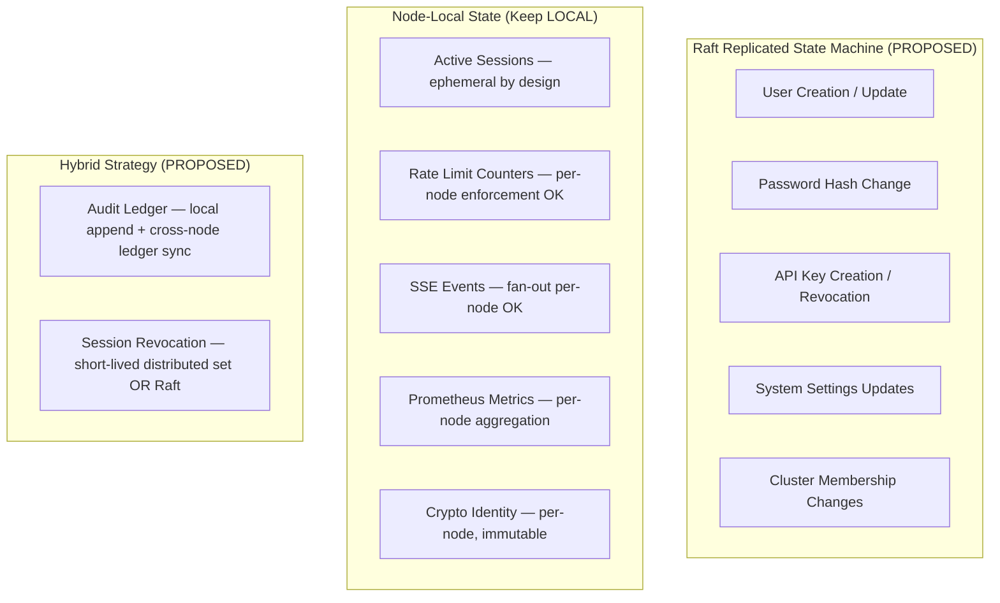

### 17.2 Raft Candidate Analysis

| State | Strong Consistency? | Durability? | Cross-node? | Raft Recommended? | Alternative |
| :--- | :--- | :--- | :--- | :--- | :--- |
| User accounts | ✅ Yes | ✅ Yes | ✅ Yes | **YES** | N/A |
| API key hashes | ✅ Yes | ✅ Yes | ✅ Yes | **YES** | N/A |
| System settings | ❌ Eventual OK | ✅ Yes | ✅ Yes | **OPTIONAL** | Shared Sled + gossip |
| Active sessions | ❌ Eventual OK | ❌ No | ✅ Yes | **NO** | Signed tokens + revocation set |
| Session revocation | ✅ Yes (security) | ❌ Short-lived | ✅ Yes | **PARTIAL** | Distributed cache with TTL |
| Audit ledger | ✅ Yes (per-node) | ✅ Yes | ❌ Per-node OK | **NO** | ledger_sync replication |
| Rate limit counters | ❌ No | ❌ No | ❌ Per-node OK | **NO** | Keep node-local |
| Cluster membership | ❌ Eventual OK | ❌ No | ✅ Yes | **PARTIAL** | Heartbeat gossip (current) |

### 17.3 Raft State Machine Architecture

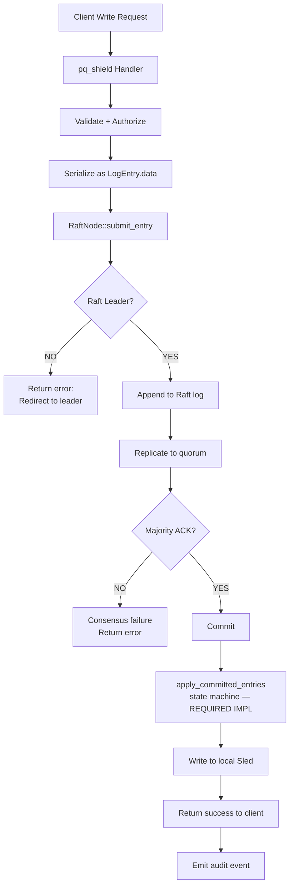

The key implementation gap is **`apply_committed_entries`** — the function that
reads committed Raft log entries and applies them to the Sled database. This
function does not currently exist.

---

## 18. Multi-Node Authentication

### 18.1 Current Problem

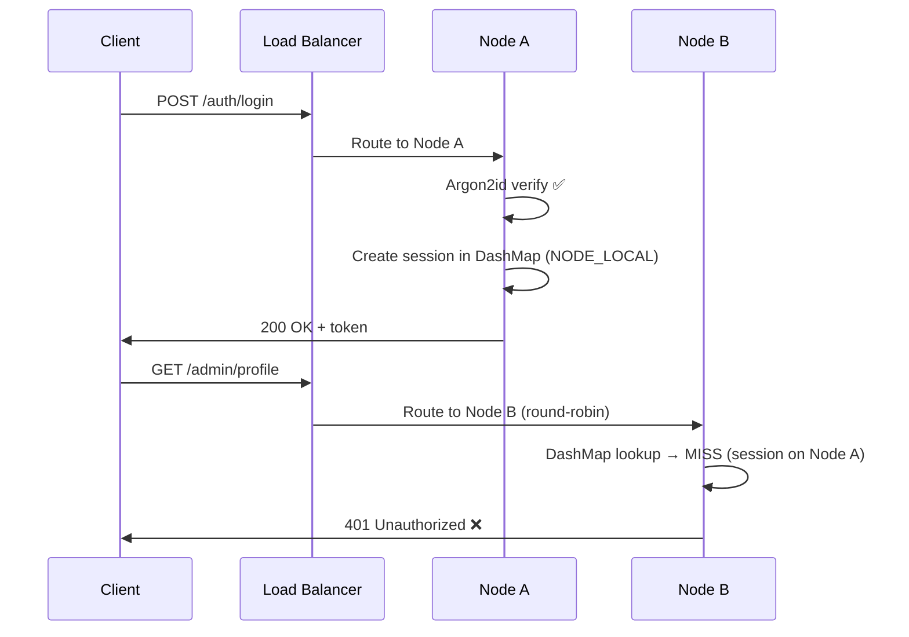

### 18.2 Proposed Multi-Node Authentication Architecture

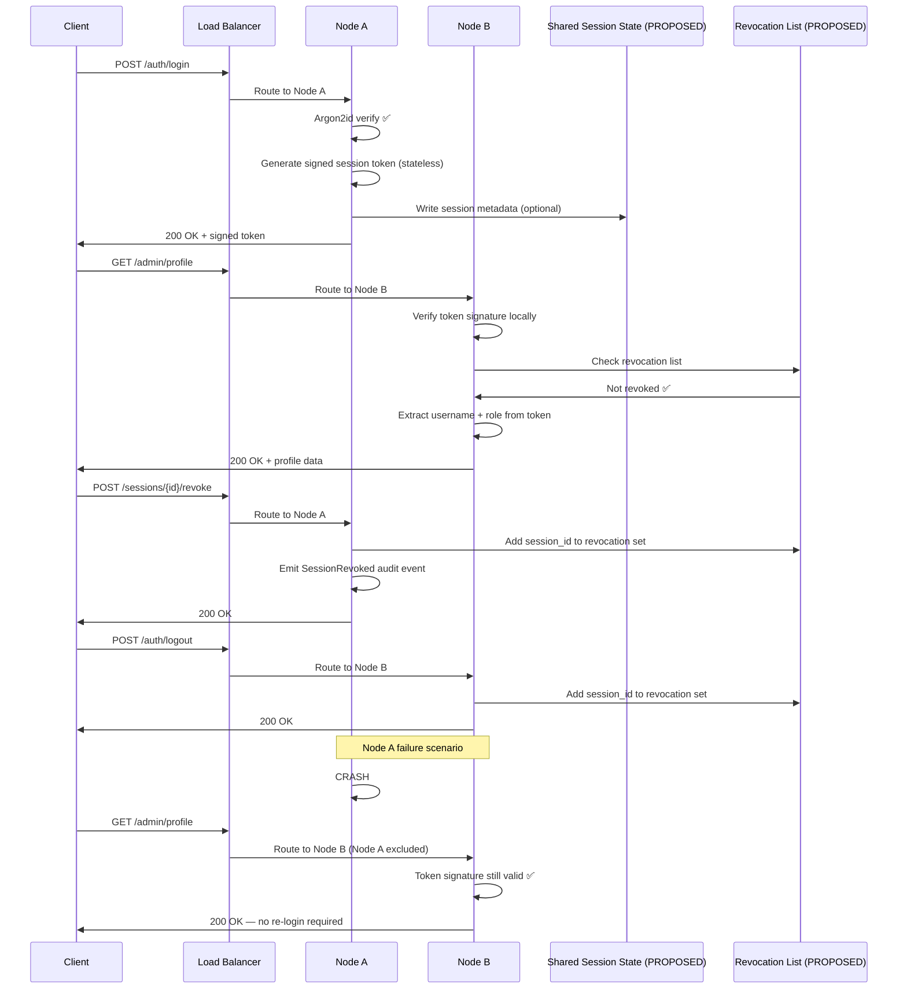

### 18.3 Node Failure Scenarios

| Scenario | Current Behavior | Proposed Behavior |
| :--- | :--- | :--- |
| Node A fails, client has session from A | 401 on Node B — re-login required | Token signature valid on B, no re-login |
| Cluster partition, client on minority side | 401 or degraded | Token still valid locally, Raft writes rejected |
| All nodes fail, then restart | All sessions lost | Revocation list may be lost, tokens still valid until expiry |
| Session revoked on Node A, request on Node B | Revocation unknown to B | Revocation in distributed set, Node B checks |

---

## 19. Administrative Operations Authorization

### 19.1 Authorization Flow for Destructive Operations

```mermaid
flowchart TD
    A[Admin Request\ne.g. Flush Sessions] --> B[Auth Middleware\ntoken validation]
    B --> C{Valid identity?}
    C -- NO --> D[401 Unauthorized\n+ audit AdministrativeOperationFailed]
    C -- YES --> E{Permission check\nuser.can(Permission::X)}
    E -- NO --> F[403 Forbidden\n+ audit AdministrativeOperationFailed]
    E -- YES --> G{Destructive operation?}
    G -- YES --> H{Confirmation present?\nconfirm: true or X-Confirm header}
    H -- NO --> I[400 Bad Request\nExplicit confirmation required]
    H -- YES --> J{MFA Step-up Required?\nPROPOSED for RebootCluster}
    J -- YES --> K[402 Step-up Required\nPOST /auth/stepup]
    K --> L[MFA Verification]
    L -- PASS --> M[Execute Operation]
    G -- NO --> M
    J -- NO --> M
    M --> N[Emit Audit Event\nML-DSA-87 signed]
    N --> O[Return Result]
```

### 19.2 Destructive Operation Classification

| Operation | Permission | Confirmation Required | MFA Step-up | Current Status |
| :--- | :--- | :--- | :--- | :--- |
| Session revoke (own) | `RevokeSession` (or self) | No | No | EXISTS |
| Session revoke (other) | `RevokeSession` | No | No | EXISTS |
| Session flush (all) | `FlushSessions` | `confirm: true` | No | EXISTS |
| API key create | `ManageApiKeys` | No | No | EXISTS |
| API key revoke | `ManageApiKeys` | No | No | EXISTS |
| Settings update | `UpdateSettings` | No | No | EXISTS |
| Cluster drain | `DrainCluster` | No | No | EXISTS |
| Cluster reboot | `RebootCluster` | `confirm: true` | PROPOSED | EXISTS (returns 501) |
| Password change | `ChangePassword` | Current password | No | EXISTS |
| MFA disable | PROPOSED | Current MFA | Yes | PROPOSED |
| Key rotation | PROPOSED | `confirm: true` | Yes | PROPOSED |

---

## 20. Audit Architecture

### 20.1 Current Audit Pipeline (Verified)

```mermaid
flowchart TD
    A[Security-sensitive action] --> B[emit_admin_audit\nauth_service::audit.rs]
    B --> C[Construct audit event JSON]
    C --> D{Has ledger?}
    D -- NO --> E[tracing::warn — logged only]
    D -- YES --> F[LedgerWriter::append]
    F --> G[Compute BLAKE3 hash chain\nBLAKE3 seq_le64 || timestamp || event_json || prev_hash]
    G --> H[Sign with ML-DSA-87 private key\n4627-byte signature]
    H --> I[Write LedgerEntry to JSONL\nappend-only]
    I --> J[File::sync_data — fsync]
    J --> K[Return to caller]
```

### 20.2 Audit Event Schema

All current audit events follow this schema:

```json
{
  "event_id":    "evt_<8-byte-hex>",
  "timestamp_ms": 1726461600000,
  "event_type":  "LoginSucceeded",
  "operation":   "LoginSucceeded",
  "actor":       "admin",
  "actor_hash":  "<blake3(actor)>",
  "node_id":     "vq-node-1",
  "result":      "success",
  "request_id":  "req_abc123",
  "details":     { ... }
}
```

### 20.3 Sensitive Data Policy

| Data Type | Logged? | Representation | Source |
| :--- | :--- | :--- | :--- |
| Passwords | ❌ Never | — | `credentials.rs` |
| Session secret token | ❌ Never | First 8 chars prefix only | `lib.rs:144` |
| API key plaintext | ❌ Never | key_id only | `lib.rs:616` |
| Private keys | ❌ Never | — | `core_crypto` |
| Usernames (tracing) | ✅ Hashed | `blake3_hex(username)` | `lib.rs:148` |
| Usernames (audit) | ✅ Plaintext + hash | `actor + actor_hash` | `audit.rs` |
| Client IP | ✅ Plaintext | `ip.to_string()` | `lib.rs` |
| Session target user | ✅ Hashed | `target_user_hash` | `lib.rs:495` |

### 20.4 Proposed Audit Extension for Persona and Role

```json
{
  "event_id":    "evt_<hex>",
  "timestamp_ms": 1726461600000,
  "event_type":  "DrainCluster",
  "actor":       "alice",
  "actor_hash":  "<blake3(alice)>",
  "actor_role":  "cluster_operator",
  "actor_persona": "soc_operator",       // PROPOSED
  "node_id":     "vq-node-1",
  "result":      "success",
  "request_id":  "req_abc123",
  "details":     { "drain_timeout_secs": 30 }
}
```

---

## 21. Dashboard Architecture

### 21.1 Dashboard Routing

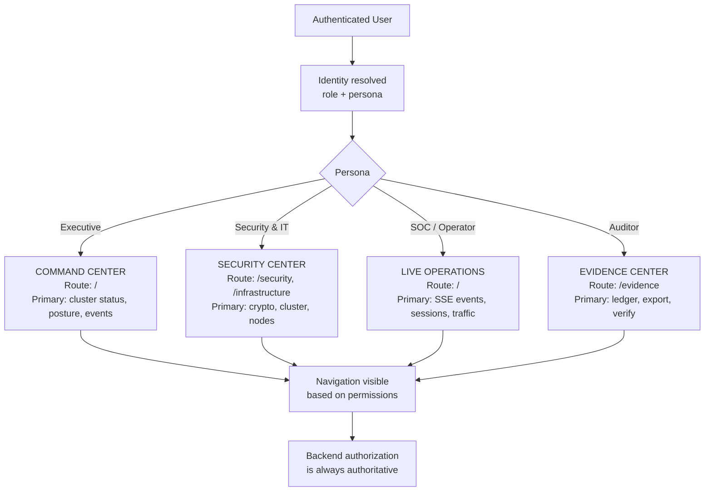

### 21.2 Current Navigation (Source Evidence)

**Source**: `frontend/components/DashboardLayout.js:21-31`

```javascript
const menuItems = [
  { text: 'Overview',        path: '/'               },
  { text: 'Infrastructure',  path: '/infrastructure' },
  { text: 'Reliability',     path: '/reliability'    },
  { text: 'Security',        path: '/security'       },
  { text: 'Consensus',       path: '/consensus'      },
  { text: 'Network',         path: '/network'        },
  { text: 'Evidence',        path: '/evidence'       },
  { text: 'Intelligence',    path: '/intelligence'   },
  { text: 'Admin',           path: '/admin'          },
];
```

All menu items are currently shown to all authenticated users regardless of
role. The backend enforces permissions at the API level.

### 21.3 Frontend-Frozen Statement

**The current frontend is STABLE and FROZEN for this phase.**  
No frontend changes are implemented in this architecture phase.

The following are *requirements* for future frontend phases:

1. Add persona field to login/profile flow
2. Add persona selection screen after authentication (if multiple available)
3. Filter navigation by permission (presentation-only, backend is authoritative)
4. Add Technical Mode toggle (gated by `ReadRuntime` permission)
5. Add Developer Settings panel (gated by `ManageDeveloperSettings`)
6. Display settings with `Mutability` classification badges
7. Never display demo data or simulated values as real telemetry

---

## 22. Technical Drill-Down Architecture

### 22.1 Universal Drill-Down Model

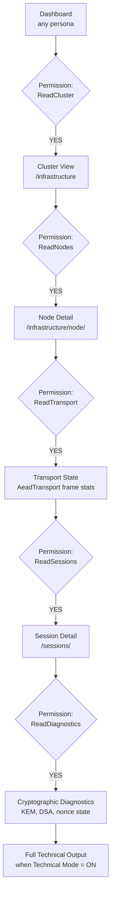

---

## 23. Security Boundaries

### 23.1 Trust Boundary Diagram

```mermaid
flowchart TD
    subgraph BROWSER["BROWSER (Untrusted)"]
        BR1[React/Next.js UI\nNo secrets stored]
        BR2[window.__VARDHAN_ADMIN_TOKEN__\nin-memory only]
    end
    subgraph FRONTEND["FRONTEND SERVER (Next.js, Node.js)"]
        FE1[/api/admin/[...path]/route.js\nServer-side reverse proxy]
        FE2[VARDHAN_BACKEND_URL\nenv var — never exposed to browser]
        FE3[Auth token forwarded\nto backend per request]
    end
    subgraph TRUST1["=== Trust Boundary: HTTPS ==="]
    end
    subgraph BACKEND["BACKEND (pq_shield Axum)"]
        BE1[Auth Middleware\nSession → AdminToken → APIKey]
        BE2[Permission Gate\nuser.can(Permission)]
        BE3[Handler Logic]
        BE4[audit::emit_admin_audit]
    end
    subgraph AUTHSVC["auth_service"]
        AS1[SessionStore — RAM DashMap]
        AS2[CredentialStore — Sled]
        AS3[RateLimiter — RAM DashMap]
    end
    subgraph CRYPTO["core_crypto"]
        CR1[QuantumNodeIdentity\nML-KEM-1024 + ML-DSA-87]
        CR2[AES-256-GCM vault]
    end
    subgraph LEDGER["audit_ledger"]
        LE1[LedgerWriter\nappend-only JSONL]
        LE2[BLAKE3 hash chain\nML-DSA-87 signed]
    end
    subgraph CLUSTER["ha_cluster"]
        CL1[RaftNode\nelection + log]
        CL2[ClusterMembership\nheartbeat gossip]
        CL3[AeadTransport\nPQ AEAD peer links]
    end
    subgraph TRUST2["=== Trust Boundary: No direct access ==="]
    end
    subgraph CLUSTERAUTH["NODE-LOCAL AUTHORITATIVE STATE (current)"]
        ST1[Sled DB\nusers + API keys + settings]
        ST2[Audit JSONL\nappend-only, fsynced]
    end

    BR1 --> FE1
    BR2 --> FE1
    FE1 --> BE1
    BE1 --> AS1
    BE1 --> AS2
    BE1 --> AS3
    BE2 --> BE3
    BE3 --> BE4
    BE4 --> LE1
    LE1 --> LE2
    BE3 --> CR1
    CL1 --> CL3
    BE1 --> CL2
```

---

## 24. Frontend Requirements (Future Implementation)

> **NOT implemented now. This section defines what the engineering team will build.**

| Requirement | Priority | Related Phase |
| :--- | :--- | :--- |
| Persona field in login and profile API | High | Phase 1 |
| Persona selection screen post-login | High | Phase 1 |
| Default workspace routing by persona | High | Phase 1 |
| Permission-filtered navigation (presentation) | Medium | Phase 2 |
| Technical Mode toggle in UI | High | Phase 6 |
| Developer Settings panel | High | Phase 7 |
| MFA enrollment flow (TOTP first) | High | Phase 2 |
| MFA verification screen in login flow | High | Phase 2 |
| Step-up authentication for destructive ops | Medium | Phase 2 |
| Settings `Mutability` badges in UI | Medium | Phase 5 |
| `PERSISTED_ONLY` warning for non-live settings | High | Phase 5 |
| No demo data / simulated values in prod UI | Critical | Phase 1+ |
| SSO login button | Low | Phase 11 |
| Recovery code entry | Low | Phase 2 |
| Enterprise SSO screen | Low | Phase 11 |

---

## 25. Backend Requirements (Future Implementation)

> **NOT implemented now. This section defines what the engineering team will build.**

| Requirement | Priority | Related Phase | Current Status |
| :--- | :--- | :--- | :--- |
| Persona field on `AdminProfile` | High | Phase 1 | `REQUIRES CHANGE` |
| `SecurityManager`, `Auditor`, `Developer` roles | High | Phase 2 | `NEW` |
| Expanded Permission enum (30 permissions) | High | Phase 2 | `REQUIRES CHANGE` |
| TOTP MFA enrollment + verification endpoints | High | Phase 2 | `NEW` |
| Recovery code generation + verification | Medium | Phase 2 | `NEW` |
| Stateless signed session tokens | High | Phase 3 | `NEW` |
| Distributed revocation list with TTL | High | Phase 3 | `NEW` |
| Fix `revoked` DashMap unbounded growth | Critical | Phase 3 | `REQUIRES CHANGE` |
| Raft-replicated user writes | High | Phase 8 | `REQUIRES CHANGE` |
| Raft-replicated API key writes | High | Phase 4 + 8 | `REQUIRES CHANGE` |
| `apply_committed_entries` state machine | High | Phase 8 | `NEW` |
| Settings `watch` channel for runtime wiring | High | Phase 5 | `NEW` |
| API key scoped roles (not always Admin) | Medium | Phase 4 | `REQUIRES CHANGE` |
| Technical mode settings persistence | Medium | Phase 6 | `REQUIRES CHANGE` |
| Developer settings metadata API | Medium | Phase 7 | `NEW` |
| Persona-tagged audit events | Low | Phase 1 | `REQUIRES CHANGE` |
| MFA step-up for destructive operations | Medium | Phase 2 | `NEW` |

---

## 26. API Requirements

### 26.1 Existing APIs (CURRENT — Do Not Modify Now)

All existing routes are documented in `auth_service::auth_router` and
`pq_shield::admin_router`.

### 26.2 Proposed New API Endpoints

| Method | Path | Description | Permission | Phase |
| :--- | :--- | :--- | :--- | :--- |
| `GET` | `/api/v1/me` | Current identity + persona + role | Authenticated | Phase 1 |
| `PUT` | `/api/v1/me/persona` | Set active persona | Authenticated | Phase 1 |
| `POST` | `/api/v1/auth/mfa/enroll` | Begin MFA enrollment | `ChangePassword` | Phase 2 |
| `POST` | `/api/v1/auth/mfa/enroll/verify` | Confirm MFA enrollment | `ChangePassword` | Phase 2 |
| `POST` | `/api/v1/auth/mfa` | Submit MFA code during login | Public (challenge) | Phase 2 |
| `POST` | `/api/v1/auth/stepup` | Step-up authentication | Authenticated | Phase 2 |
| `GET` | `/api/v1/settings/developer` | Developer settings metadata | `ManageDeveloperSettings` | Phase 7 |
| `PUT` | `/api/v1/settings/developer/{key}` | Update developer setting | `ManageDeveloperSettings` | Phase 7 |
| `GET` | `/api/v1/diagnostics` | Full runtime diagnostics | `ReadDiagnostics` | Phase 6 |
| `GET` | `/api/v1/nodes/{id}` | Per-node status | `ReadNodes` | Future |
| `GET` | `/api/v1/replication/status` | Raft replication state | `ReadReplication` | Phase 8 |

---

## 27. Data Model

### 27.1 Identity Data Model (Current + Proposed)

```
AdminProfile (current, Sled key: profile:<username>) {
  username:       String     -- primary key
  display_name:   String
  email:          String
  role:           String     -- "ciso_admin", "cluster_operator", "user"
  updated_at_ms:  u128
}

AdminProfile (proposed additions) {
  persona:        Option<String>  -- PROPOSED: "executive", "security_it", "soc", "auditor"
  mfa_enrolled:   bool            -- PROPOSED
  mfa_secret_enc: Option<Vec<u8>> -- PROPOSED: encrypted TOTP seed
  mfa_methods:    Vec<String>     -- PROPOSED: ["totp"]
}
```

### 27.2 Session Data Model (Current)

```
SessionEntry (RAM only, key: token_str) {
  session_id:      String   -- "sess_<16-hex>"
  username:        String
  created_at_ms:   u128
  last_activity_ms: u128
  expires_at_ms:   u128
  ip:              String
  node_id:         String
  revoked:         bool
}
```

### 27.3 API Key Data Model (Current)

```
ApiKeyRecord (Sled key: apikey:<id>) {
  id:              String   -- "ak_<16-hex>"
  name:            String
  key_hash:        String   -- blake3(secret) hex
  created_at_ms:   u128
  expires_at_ms:   Option<u128>
  revoked:         bool
  last_used_at_ms: Option<u128>
  created_by:      String   -- username
}
```

---

## 28. Failure States

| Failure | Immediate Effect | Recovery |
| :--- | :--- | :--- |
| Node A restart | All sessions on A lost — 401 for affected clients | Re-login; mitigated by stateless tokens (Phase 3) |
| Revoked DashMap OOM | Node crash or swapping | Fix bounded TTL cache (Phase 3, critical) |
| Node A creates user, Node B receives auth | 401 Unauthorized | Raft-replicated users (Phase 8) |
| Settings updated, runtime not reloaded | Configuration drift | Phase 5 watch channels |
| Raft leader lost during API key write | Write rejected — 500 or leader redirect | Client retry; leader re-elected within election timeout |
| Cluster partition (< quorum) | Raft writes rejected; reads from local state | Partition heals; minority nodes lag |
| Audit ledger disk full | fsync failure — append fails | Alert and stop; do not silently discard audit events |
| MFA seed compromise | Attacker can bypass MFA | Recovery codes; admin MFA reset |

---

## 29. Future Enterprise Model

The following structure is not currently implemented. The data model must
not be designed in a way that makes future multi-tenancy impossible.

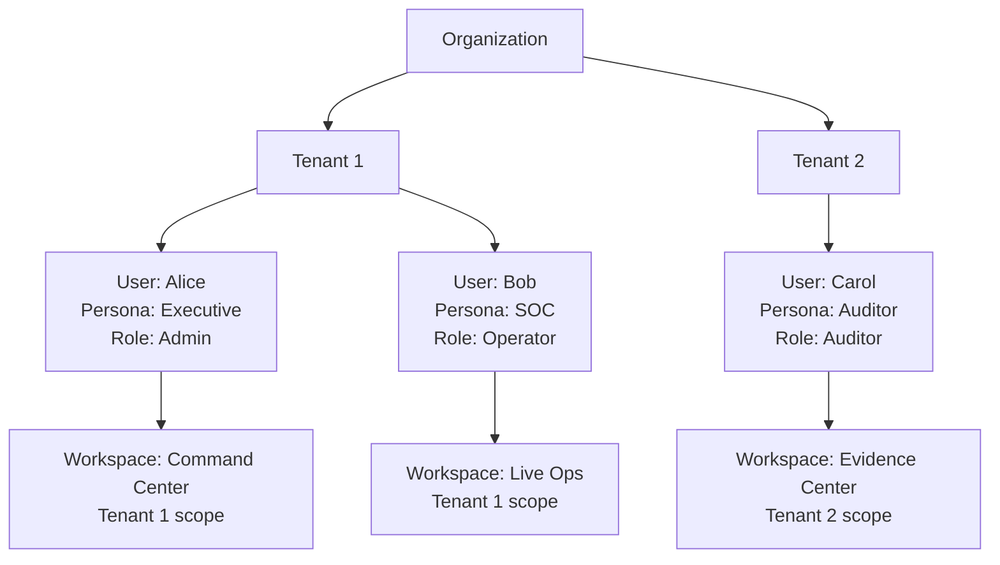

**Design constraint**: The `username` field is a free string today. Future
multi-tenancy will require `(org_id, tenant_id, username)` as a composite key.
The Sled key prefix `profile:<username>` should be scoped as
`profile:<tenant_id>:<username>` in a future phase.

---

## 30. Mermaid Architecture Diagrams

### 30.1 Complete End-to-End Architecture

```mermaid
flowchart TD
    subgraph USER["User Layer"]
        U1[Browser]
        U2[API Client]
    end
    subgraph AUTHN["Authentication Layer"]
        A1[Login: Argon2id\nTiming-safe]
        A2[Rate Limit: 10 fails/15min\nper IP, NODE_LOCAL]
        A3[MFA: TOTP — PROPOSED]
    end
    subgraph IDENTITY["Identity Layer"]
        I1[AdminProfile\nusername + role + persona]
        I2[SessionStore\nNODE_LOCAL — Gap]
        I3[ApiKeyStore\nNODE_LOCAL — Gap]
    end
    subgraph AUTHZ["Authorization Layer"]
        Z1[AuthenticatedUser\nusername + role]
        Z2[Permission Gate\nuser.can(perm)]
        Z3[Persona Routing\nfrontend only]
    end
    subgraph RESOURCES["Resource Layer"]
        R1[Sessions]
        R2[API Keys]
        R3[Settings]
        R4[Cluster Operations]
        R5[Audit Ledger]
        R6[Metrics & Diagnostics]
    end
    subgraph AUDIT["Audit Layer"]
        AU1[emit_admin_audit]
        AU2[LedgerWriter\nappend-only JSONL]
        AU3[BLAKE3 hash chain]
        AU4[ML-DSA-87 signature\n4627 bytes per entry]
    end
    subgraph CLUSTER["Cluster Layer"]
        CL1[RaftNode\nelection + log]
        CL2[AeadTransport\nML-KEM-1024 + AES-256-GCM]
        CL3[ClusterMembership\nheartbeat gossip UDP]
    end

    U1 --> A1
    U2 --> A1
    A1 --> A2
    A2 --> A3
    A3 --> I1
    I1 --> I2
    I1 --> I3
    I2 --> Z1
    I3 --> Z1
    Z1 --> Z2
    Z2 --> RESOURCES
    Z2 --> Z3
    RESOURCES --> AU1
    AU1 --> AU2
    AU2 --> AU3
    AU3 --> AU4
    CL1 --> CL2
    CL2 --> CL3
```

---

## 31. Migration Strategy

### 31.1 Recommended Implementation Order

The following phases are presented in dependency-correct order. Phase N may
not begin until Phase N-1 is complete and tested.

---

**Phase 1: Identity / Persona Model**

*Rationale*: All other work depends on the expanded identity model.

- Add `persona` field to `AdminProfile` Sled record
- Add `persona` to `GET /api/v1/me` response
- Add `PUT /api/v1/me/persona` endpoint
- Add persona field to audit event schema
- Default persona assignment by role
- Persona selection logic in authentication response

**Crates modified**: `auth_service`, `pq_shield`  
**Frontend**: `FROZEN` — document requirements only

---

**Phase 2: RBAC Refinement + MFA**

*Rationale*: RBAC expansion and MFA are foundational security features.

- Add `Auditor`, `SecurityManager`, `Developer` roles to `Role` enum
- Expand `Permission` enum with 19 new permissions
- Add TOTP MFA: enrollment, verification, recovery codes endpoints
- Add MFA step-up for `RebootCluster` operation
- Update audit events to include `actor_role` and `actor_persona`

**Crates modified**: `auth_service`, `pq_shield`  
**New dependencies**: `totp-rs`

---

**Phase 3: Session Architecture**

*Rationale*: Must fix the unbounded `revoked` map growth before production and
design the cross-node session model.

- Fix `revoked: Arc<DashMap>` — replace with bounded TTL-evicting structure
- Design and implement stateless signed session tokens (or short-lived JWTs)
- Implement distributed revocation set (in-memory distributed cache or Raft)
- Update session validation to check revocation list cross-node

**Crates modified**: `auth_service`, `pq_shield`  
**New dependencies**: TBD (JWT crate or custom signed token)

---

**Phase 4: API Key Architecture**

*Rationale*: Depends on Phase 3 session infrastructure.

- Add `role` and `scopes` fields to `ApiKeyRecord`
- Remove hardcoded `Role::Admin` for all API keys
- Design Raft-write path for API key creation (prep for Phase 8)
- Implement TTL-based expiry enforcement at authentication time

**Crates modified**: `auth_service`

---

**Phase 5: Settings Runtime Wiring**

*Rationale*: Settings are currently `PERSISTED_ONLY`. Phase 3 fixes sessions;
Phase 5 makes the platform configuration-driven.

- Introduce `tokio::sync::watch` broadcast for `SettingsConfig`
- Wire `session_idle_timeout_secs` into `SessionStore` validation
- Wire `max_failed_logins` into `RateLimiter`
- Wire `heartbeat_interval_ms` into `ha_cluster` heartbeat
- Wire `max_connections` into `pq_shield` concurrency limiter
- Wire `min_password_length` into `credentials.rs` validation

**Crates modified**: `auth_service`, `ha_cluster`, `pq_shield`

---

**Phase 6: Technical Mode**

- Add `technical_mode` field to `UserSettings`
- Implement `ReadRuntime`, `ReadDiagnostics` permissions in backend
- Add `GET /api/v1/diagnostics` endpoint returning full runtime state
- Define which fields are exposed in technical mode vs normal mode

**Crates modified**: `auth_service`, `pq_shield`  
**Frontend**: (frozen) Document UI requirements

---

**Phase 7: Developer Settings**

- Implement `DevSettingMetadata` response format
- Add `GET /api/v1/settings/developer` with full metadata
- Add `PUT /api/v1/settings/developer/{key}` with mutability enforcement
- All settings labeled with `Mutability` classification

**Crates modified**: `auth_service`, `pq_shield`

---

**Phase 8: Cluster-Authoritative Application State**

*This is the most complex phase and requires careful design and testing.*

- Implement `apply_committed_entries` state machine in `ha_cluster`
- Route user writes through `RaftNode::submit_entry`
- Route API key create/revoke through Raft log
- Route settings writes through Raft log (optional — may stay eventual)
- Add `GET /api/v1/replication/status` endpoint

**Crates modified**: `ha_cluster`, `auth_service`, `pq_shield`

---

**Phase 9: Multi-Node Validation**

- Integration test: create session on Node A, validate on Node B
- Integration test: create API key on Node A, authenticate on Node B
- Integration test: revoke session on Node A, confirm rejected on Node B
- Load test: cross-node authentication under cluster partition

---

**Phase 10: Frontend Integration**

- Implement persona selection screen
- Implement default workspace routing
- Implement Technical Mode toggle
- Implement Developer Settings panel
- Implement MFA enrollment and verification screens
- Implement permission-filtered navigation

---

**Phase 11: Enterprise Hardening**

- Multi-tenant model (org_id + tenant_id composite keys)
- Enterprise SSO (SAML / OIDC)
- WebAuthn / Passkeys
- Hardware security key (FIDO2)

---

## 32. Open Questions

1. **Session token design (Phase 3)**: Should Vardhan Quantum use a standard
   JWT with ML-DSA-87 signature, or a custom signed token format? Custom format
   avoids JWT library dependencies but requires careful design.

2. **Revocation list backend (Phase 3)**: Should the revocation set use a
   distributed cache (Redis/Valkey) or be Raft-replicated? Redis adds
   infrastructure complexity. Raft adds consistency.

3. **API key role scoping (Phase 4)**: Should all existing API keys be
   grandfathered as `Role::Admin`, or should there be an explicit migration?
   This is a breaking change for callers.

4. **Raft write latency (Phase 8)**: Raft writes require quorum (majority of
   nodes). What is the acceptable P99 latency for user creation and API key
   provisioning? This determines whether Raft is viable or whether a different
   consensus strategy is needed.

5. **Audit ledger cross-node replication (Phase 8)**: Should the JSONL audit
   ledger be replicated via `ledger_sync`, via Raft log, or remain per-node?
   Per-node audit ledgers are forensically valid but complicate evidence collection.

6. **MFA seed encryption (Phase 2)**: TOTP seeds must be stored encrypted.
   Should they use the node's AES-256-GCM vault (from `core_crypto::vault.rs`)
   or a separate per-user KDF?

7. **Persona vs Role overlap (Phase 1)**: If a user is `Role::Admin`, should
   they automatically have access to all four persona experiences, or should
   access to persona experiences be explicitly granted?

8. **Bootstrap admin token lifecycle**: The `VARDHAN_ADMIN_TOKEN` env var
   bypasses all RBAC and is designed for initial bootstrap only. Should it be
   disabled after first user creation?

---

## 33. Architectural Decisions

### 33.1 Persona Model
- Persona is a **presentation preference**, not an authorization boundary.
- Persona is stored as a field on `AdminProfile`.
- Role determines which personas are accessible; frontend routes based on persona.
- Four personas: Executive, Security & IT, SOC/Operator, Auditor.

### 33.2 Role Model
- Three existing roles (`Admin`, `Operator`, `User`) are preserved and unchanged.
- Three new roles are proposed: `SecurityManager`, `Auditor`, `Developer`.
- No role is replaced; new roles are added.
- `Role::from_str` handles aliases for backward compatibility.

### 33.3 Permission Model
- Permission enum expands from 11 to 30 permissions.
- New permissions are additive; no existing permission is removed.
- API keys should be scoped to explicit roles, not hardcoded to Admin.

### 33.4 MFA Model
- TOTP (RFC 6238) is the first MFA method to implement.
- Architecture supports WebAuthn and SSO as future methods.
- MFA enrollment, verification, and recovery follow standard flows.
- Step-up authentication is required for `RebootCluster`.

### 33.5 Session Model
- Sessions move toward stateless signed tokens with cluster-wide revocation list.
- Immediate fix: replace unbounded `revoked` DashMap with bounded TTL structure.
- Long-term: any node validates token signature without shared session state.

### 33.6 API Key Model
- BLAKE3 hashing of secrets is retained (correct design).
- API key metadata moves through Raft log (Phase 8) for cross-node consistency.
- API keys gain explicit `role` and `scopes` fields.

### 33.7 Settings Model
- Settings persist to Sled (correct design).
- Settings are broadcast to runtime via `tokio::sync::watch` channels (Phase 5).
- Developer settings panel provides metadata about each setting's mutability.
- UI must indicate `PERSISTED_ONLY` vs live-wired settings.

### 33.8 Technical Mode Model
- Technical Mode is a boolean preference on `UserSettings`.
- Access is gated by `Permission::ReadRuntime` and `Permission::ReadDiagnostics`.
- Technical Mode NEVER exposes credentials, private keys, or session secrets.

### 33.9 Developer Settings Model
- Dedicated panel with categorized settings and metadata.
- Every setting has `Mutability` classification.
- Some settings remain `NotImplemented` (PERSISTED_ONLY) until Phase 5.

### 33.10 Audit Model
- Current Merkle hash chain with ML-DSA-87 signing is retained.
- Audit events are extended with `actor_role` and `actor_persona` fields.
- Usernames remain BLAKE3-hashed in tracing logs; plaintext+hash in ledger.

### 33.11 Raft Boundary
- User accounts and API key metadata: route through Raft (Phase 8).
- Sessions: node-local RAM → stateless tokens (Phase 3). NOT in Raft.
- Rate limiter: stays node-local (per-node enforcement is acceptable).
- Audit ledger: stays node-local per-node with optional ledger_sync (existing crate).
- Settings: Raft-optional; watch-channel wiring to runtime is higher priority.

### 33.12 State Ownership
- `CLUSTER_AUTHORITATIVE`: Raft log/terms, user DB (Phase 8), API key metadata (Phase 8).
- `NODE_LOCAL` (acceptable): rate limiter, SSE history, prometheus metrics, crypto identity.
- `NODE_LOCAL` (gaps): sessions (Phase 3), API keys (Phase 4+8), settings (Phase 5).
- `DERIVED`: entropy, active session count, cluster health.
- `EPHEMERAL`: AEAD transport frames, MFA nonces, proxy buffers.

### 33.13 Multi-Node Authentication Model
- Short-term: sticky sessions in load balancer.
- Medium-term: stateless signed tokens (Phase 3).
- Long-term: full cluster-authoritative identity via Raft.

---

## 34. Implementation Priority

| Priority | Phase | Description | Gap Addressed |
| :--- | :--- | :--- | :--- |
| 🔴 Critical | 3 | Fix revoked DashMap unbounded growth | Gap 3 (memory risk) |
| 🔴 Critical | 5 | Wire settings to runtime via watch channels | Gap 5 (PERSISTED_ONLY) |
| 🟠 High | 1 | Add persona field to identity model | Architecture foundation |
| 🟠 High | 2 | Expand RBAC (Auditor, SecurityManager roles + permissions) | Architecture foundation |
| 🟠 High | 2 | TOTP MFA implementation | Security hardening |
| 🟠 High | 3 | Stateless signed session tokens | Gaps 1, 2 (NODE_LOCAL sessions) |
| 🟠 High | 4 | API key scoped roles | Gap 4 (NODE_LOCAL API keys) |
| 🟡 Medium | 6 | Technical Mode implementation | Developer visibility |
| 🟡 Medium | 7 | Developer Settings panel | Operational observability |
| 🟡 Medium | 8 | Raft-replicated application state | Gaps 4, 6 (cross-node consistency) |
| 🟢 Low | 9 | Multi-node integration test suite | Verification |
| 🟢 Low | 10 | Frontend persona + technical mode integration | UX |
| 🟢 Low | 11 | Enterprise SSO, multi-tenancy | Future growth |

---

*End of Enterprise Identity & Access Architecture Document.*
*Version 1.0 — Architecture Phase Only — No Source Code Modified.*
